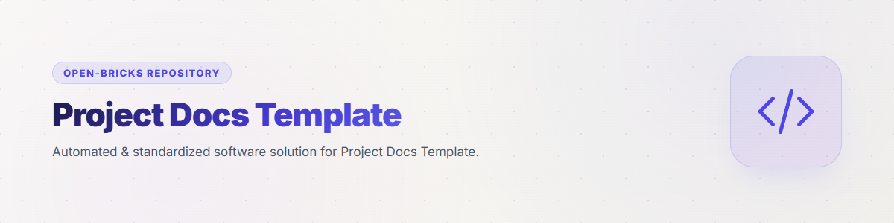
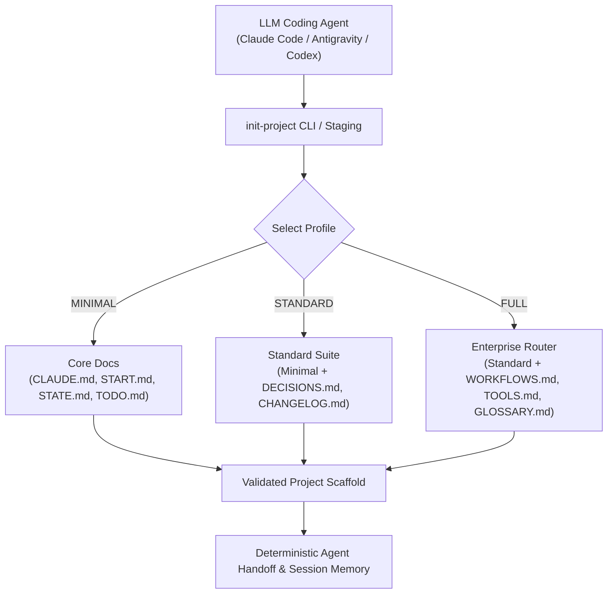
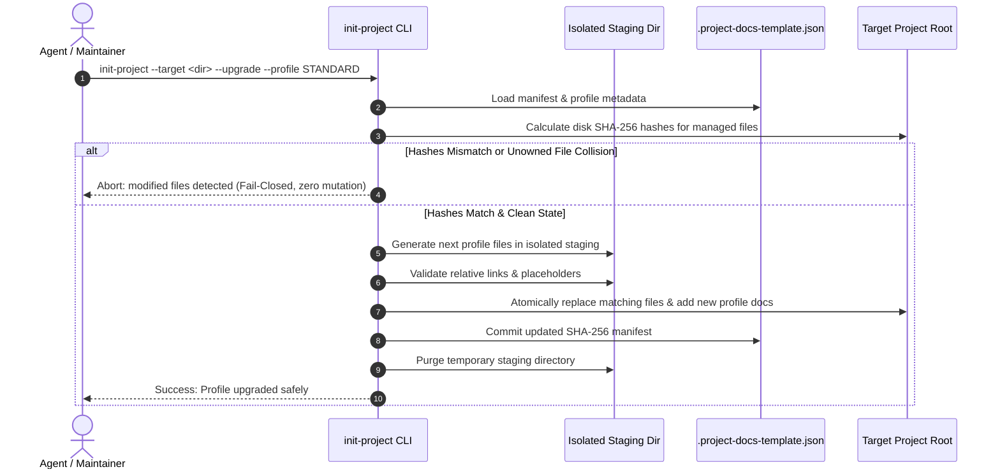

# Project Docs Template




[](https://github.com/ellmos-ai/project-docs-template)
[](./pyproject.toml)
[](./pyproject.toml)
[](./RELEASE_GATE.md)
[](./tests)
[](./SECURITY.md)
[](./SECURITY.md)
[](https://github.com/ellmos-ai)
[](https://github.com/open-bricks)
[](./llms.txt)
[](https://github.com/ellmos-ai/project-docs-template/actions/workflows/ci.yml)
[](./README_de.md)
[](./LICENSE)

Agent-ready project documentation template with START/STATE/TODO/DONE,
workflows, lightweight tooling, and LLM-friendly project memory.

> [!NOTE]
> This repository is machine-readable and agent-optimized. AI coding assistants (Claude Code, Antigravity/Gemini, Codex) can read [`llms.txt`](./llms.txt) for a fast context index and run `pytest` (34 tests passing, 7 subtests) to verify template generation and upgrade integrity.

> Independent project — not affiliated with Anthropic, OpenAI, or Google.
> See [Trademarks](#trademarks).

This repository contains a compact documentation scaffold for projects that are
maintained with LLM agents. The template focuses on clear project state,
session handoff, task history, decision records, workflows, and small local
utilities without turning the project into a heavy operating system.

## Architecture & Flow



## Use This Template When

| Situation | Why it helps |
|---|---|
| A new project will be maintained by Claude Code, Codex, Gemini CLI, or another coding agent | Gives the agent a predictable bootstrap path and current-state file. |
| An existing repo has scattered notes, stale task files, or no handoff trail | Separates active work, completed work, decisions, patterns, and session state. |
| Multiple agents or humans need to resume work safely | Keeps instructions, current state, workflows, and tools in distinct files. |

This is a documentation and coordination template, not a runtime framework. It
is meant to sit inside ordinary software, research, or operations repositories.

## What Is Included

- `CLAUDE.md` and `AGENTS.md` for agent instructions
- `START.md` and `STATE.md` for session bootstrap and current state
- `TODO.md` and `DONE.md` with optional archival tooling
- `DECISIONS.md`, `PATTERNS.md`, `CHANGELOG.md`, and `HEADER-RULES.md`
- Optional FULL-profile routers: `WORKFLOWS.md`, `TOOLS.md`, `GLOSSARY.md`
- Local helpers in `_tools/`, including `init-project`, `doc-lint`,
  `todo-archive`, and `workflows-sync`

The actual template files live in [`template/`](./template/).

## Quick Start

Clone this repository and instantiate a project profile:

```bash
git clone https://github.com/ellmos-ai/project-docs-template.git
cd project-docs-template
python template/_tools/init-project --target ../my-project --name MyProject --profile STANDARD
```

Add `--author "Your Name"` to set explicit frontmatter ownership or `--git` to
create a `main` repository and initial commit. Without `--author`, the tool uses
`git config user.name` and then the local OS account as a safe fallback.

Generation is staged beside the target. The result is promoted only after its
profile markers, generator-owned placeholders, and relative Markdown links
have been validated. Existing non-empty targets are never overwritten.

### Merge-safe profile upgrades

Every generated project carries `.project-docs-template.json`, a manifest of
the generated profile and SHA-256 hashes for its managed files. Upgrade one
step at a time with:

```bash
python template/_tools/init-project --target ../my-project \
  --profile STANDARD --upgrade
```

The upgrade process follows a strict staging and validation lifecycle:



The command stages the next profile first. It replaces only files whose
manifest hash still matches, adds only missing profile files, and updates the
manifest last. A changed managed file, an unowned filename collision, a
missing manifest, or any unsupported profile jump aborts before mutation.
There is no implicit merge; resolve user changes explicitly and rerun. Use
`--dry-run` to inspect the planned updates and additions.

Available profiles:

- `MINIMAL`: 7 root files plus essential tools
- `STANDARD`: 12 root files plus essential tools
- `FULL`: 16 root files plus workflow, tool, GitHub, and glossary scaffolding

You can also copy files manually from [`template/`](./template/) if you only
need selected pieces.

Requires Python 3.10 or newer. Git is required only for `--git`.

> [!IMPORTANT]
> This package is **not** published on PyPI. `pyproject.toml` exists for local
> tooling and metadata only. Install by cloning this repository — do **not**
> run `pip install project-docs-template`; any package under that name on a
> public index is not ours.

> [!IMPORTANT]
> **The generated documentation is currently German.** This repository's own
> documentation is English, but the template bodies under [`template/`](./template/)
> — `CLAUDE.md`, `START.md`, `STATE.md`, `TODO.md` and the rest — and the CLI
> output of `init-project`, `doc-lint`, `todo-archive` and `workflows-sync` are
> written in German. The file names, the profile markers and the YAML front
> matter keys are language-neutral, so an English project can use the structure
> and replace the prose; there is no language switch yet. An English template set
> is planned — see [`TODO.md`](./TODO.md).

## Profile Comparison

| Profile | Best for | Files copied |
|---|---|---|
| `MINIMAL` | Small repos, experiments, short-lived tools | Core agent instructions, start/state, TODO/DONE, essential tools |
| `STANDARD` | Serious projects with decisions and recurring maintenance | Minimal set plus changelog, decisions, patterns, header and cut-and-clue rules |
| `FULL` | Multi-agent or long-running projects with routers and workflows | Standard set plus architecture, workflow/tool routers, glossary, `.github/` |

## Design Principles

- Every file has a distinct job.
- Session handoff is explicit and short.
- Maintenance burden matters more than having every possible document.
- Routers such as `WORKFLOWS.md` and `TOOLS.md` point to details elsewhere.
- Completed tasks can be archived automatically instead of bloating `TODO.md`.

See [`template/TEMPLATE.md`](./template/TEMPLATE.md) for the full rationale and
file-by-file explanation.

## Verification

```bash
python -m unittest discover -s tests -v
```

The suite exercises every profile, real Git initialization, frontmatter
repair, workflow metadata escaping, and TODO/DONE rollback behavior. The same
suite runs on Linux, Windows, and macOS; see [`RELEASE_GATE.md`](./RELEASE_GATE.md).

Security reports belong in the private channel described in
[`SECURITY.md`](./SECURITY.md), not in public issues.

<!-- BEGIN GENERATED ELLMOS BUNDLE DISCOVERY -->

## Bundles and partners

Generated discovery projection for `module:project-docs-template` from `catalog:v4-bundles` (`546290dafbaafd810df1d59ef5a3d7183738472b48cd5a8a81f1e8f2b64d852e`).
Target repository visibility: `public`. Bundle manifests remain the membership authority; this section does not install or activate components.
Discovery approval: `public` module-registry record, explicit default-deny bundle allowlist.

### `ellmos-dev-lifecycle-bundle`

- Bundle recipe visibility: `private`; role: `declared-component`; requirement: `required`.
- module partners: `module:bundle-installer`, `module:ellmos-code-tools`, `module:ellmos-tests`, `module:github-onedrive-mirror`, `module:stack-system-installer`.
- skill partners: `skill:bugfix-protocol`, `skill:bugsweep`, `skill:dev-cycle`, `skill:encoding-fix`, `skill:github-repo-care`, `skill:migrate-rename`, `skill:nulcleaner`, `skill:pipeline-optimizer`, `skill:plugin-system`, `skill:project-onboarding`, `skill:trampelpfadanalyse`.

### `ellmos-knowledge-bundle`

- Bundle recipe visibility: `private`; role: `declared-component`; requirement: `recommended`.
- module partners: `module:KnowledgeDigest`, `module:WikiStub-Seed`, `module:report-forge`, `module:web-scraper`.
- skill partners: `skill:bilingual-doc-sync`, `skill:docs-analysis`, `skill:document-chunker`.

Composition and runtime details are intentionally omitted.

<!-- END GENERATED ELLMOS BUNDLE DISCOVERY -->

## Discoverability

> Independent project — not affiliated with Anthropic, OpenAI, or Google.
> See [Trademarks](#trademarks).

Canonical search phrases:

```text
agent-ready project documentation template
LLM project docs template START STATE TODO DONE
Claude Code Codex project documentation scaffold
multi-agent repo handoff documentation template
```

For LLM and crawler-oriented metadata, see [`llms.txt`](./llms.txt).

## Ecosystem & Sibling Tools

`project-docs-template` is part of the [`ellmos-ai`](https://github.com/ellmos-ai), [`dev-bricks`](https://github.com/dev-bricks), and [`open-bricks`](https://github.com/open-bricks) open-source ecosystems.

| Repository | Purpose | Primary Surface |
|---|---|---|
| [`policy-registry`](https://github.com/ellmos-ai/policy-registry) | Machine-readable policy registry with signed delegations | CLI / API / MCP |
| [`DevCenter`](https://github.com/dev-bricks/DevCenter) | Local-first Python IDE and developer toolkit | GUI / PySide6 |
| [`CodeBox`](https://github.com/dev-bricks/CodeBox) | Isolated code playground and execution environment | GUI / CLI |
| [`companion-for-agy`](https://github.com/ellmos-ai/companion-for-agy) | Extension & companion suite for Antigravity AI agents | CLI / Node.js |
| [`safe-start-for-codex`](https://github.com/dev-bricks/safe-start-for-codex) | Defensive bootstrapping and environment verifier | CLI / Python |
| [`automizer-for-claude-desktop`](https://github.com/dev-bricks/automizer-for-claude-desktop) | Bridge & automation toolkit for Claude Desktop | CLI / Python |
| [`system-gap-master`](https://github.com/ellmos-ai/system-gap-master) | Cross-system sync & divergence analyzer | CLI / Python |
| [`lock-master`](https://github.com/ellmos-ai/lock-master) | File & resource concurrency lock manager | CLI / Python |
| [`ticket-master`](https://github.com/ellmos-ai/ticket-master) | Local-first issue & ticketing orchestrator | CLI / Python |
| [`clutch`](https://github.com/ellmos-ai/clutch) | Provider-neutral LLM router and model orchestration engine | CLI / Python |
| [`memoryhooker`](https://github.com/ellmos-ai/memoryhooker) | Session memory extraction & hook injector | CLI / Python |
| [`workflowhooker`](https://github.com/ellmos-ai/workflowhooker) | Workflow automation lifecycle triggers | CLI / Python |
| [`ellmos-controlcenter-mcp`](https://github.com/ellmos-ai/ellmos-controlcenter-mcp) | MCP server for system inspection and skill discovery | MCP / Python |
| [`ellmos-filecommander-mcp`](https://github.com/ellmos-ai/ellmos-filecommander-mcp) | MCP server for safe local file operations | MCP / Python |
| [`open-bricks`](https://github.com/open-bricks) | Umbrella organization for developer & AI tools | Portal |

## Trademarks

This project is an independent, community-maintained documentation template.
It is **not** affiliated with, endorsed by, sponsored by, or otherwise connected
to Anthropic, OpenAI, or Google.

"Claude" and "Claude Code", "Codex", "Gemini" and "Antigravity" are trademarks
or registered trademarks of their respective owners (Anthropic PBC, OpenAI,
Google LLC). All other product names, logos, and brands are the property of
their respective owners. They are used here solely to describe compatibility
and interoperability, and their use does not imply any endorsement,
authorisation, or business relationship.

## License

MIT License. See [LICENSE](./LICENSE).

This project is an unpaid open-source contribution. The MIT license applies.
Where German law governs and the transfer qualifies as a gift (Schenkung),
liability is limited to intent and gross negligence under Section 521 of the
German Civil Code (BGB). Mandatory statutory liability — in particular for
intent (Section 276(3) BGB) and for injury to life, body, or health — remains
unaffected and is not excluded by the MIT disclaimer. Use at your own risk. No
warranty, maintenance guarantee, availability guarantee, or fitness-for-purpose
guarantee is provided.

