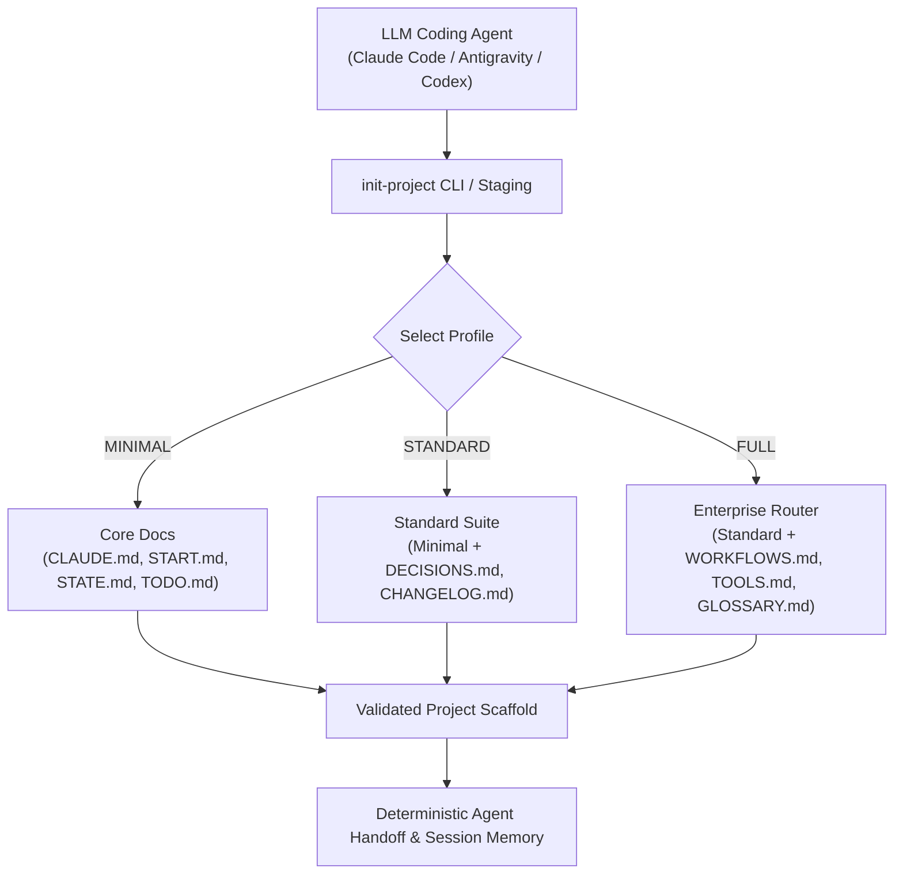

# Project Docs Template

[](https://github.com/ellmos-ai/project-docs-template)
[](https://github.com/ellmos-ai/project-docs-template/actions/workflows/ci.yml)
[](./tests/test_tools.py)
[](./README_de.md)
[](./LICENSE)

Agent-ready project documentation template with START/STATE/TODO/DONE,
workflows, lightweight tooling, and LLM-friendly project memory.

> [!NOTE]
> This repository is machine-readable and agent-optimized. AI coding assistants (Claude Code, Antigravity/Gemini, Codex) can read [`llms.txt`](./llms.txt) for a fast context index and run `pytest` (18 tests passing) to verify template generation integrity.

This repository contains a compact documentation scaffold for projects that are
maintained with LLM agents. The template focuses on clear project state,
session handoff, task history, decision records, workflows, and small local
utilities without turning the project into a heavy operating system.

## Architecture & Flow



## Use This Template When

| Situation | Why it helps |
|---|---|
| A new project will be maintained by Claude Code, Codex, Gemini CLI, or another coding agent | Gives the agent a predictable bootstrap path and current-state file. |
| An existing repo has scattered notes, stale task files, or no handoff trail | Separates active work, completed work, decisions, patterns, and session state. |
| Multiple agents or humans need to resume work safely | Keeps instructions, current state, workflows, and tools in distinct files. |

This is a documentation and coordination template, not a runtime framework. It
is meant to sit inside ordinary software, research, or operations repositories.

## What Is Included

- `CLAUDE.md` and `AGENTS.md` for agent instructions
- `START.md` and `STATE.md` for session bootstrap and current state
- `TODO.md` and `DONE.md` with optional archival tooling
- `DECISIONS.md`, `PATTERNS.md`, `CHANGELOG.md`, and `HEADER-RULES.md`
- Optional FULL-profile routers: `WORKFLOWS.md`, `TOOLS.md`, `GLOSSARY.md`
- Local helpers in `_tools/`, including `init-project`, `doc-lint`,
  `todo-archive`, and `workflows-sync`

The actual template files live in [`template/`](./template/).

## Quick Start

Clone this repository and instantiate a project profile:

```bash
git clone https://github.com/ellmos-ai/project-docs-template.git
cd project-docs-template
python template/_tools/init-project --target ../my-project --name MyProject --profile STANDARD
```

Add `--author "Your Name"` to set explicit frontmatter ownership or `--git` to
create a `main` repository and initial commit. Without `--author`, the tool uses
`git config user.name` and then the local OS account as a safe fallback.

Generation is staged beside the target. The result is promoted only after its
profile markers, generator-owned placeholders, and relative Markdown links
have been validated. Existing non-empty targets are never overwritten.

Available profiles:

- `MINIMAL`: 7 root files plus essential tools
- `STANDARD`: 12 root files plus essential tools
- `FULL`: 16 root files plus workflow, tool, GitHub, and glossary scaffolding

You can also copy files manually from [`template/`](./template/) if you only
need selected pieces.

Requires Python 3.10 or newer. Git is required only for `--git`.

## Profile Comparison

| Profile | Best for | Files copied |
|---|---|---|
| `MINIMAL` | Small repos, experiments, short-lived tools | Core agent instructions, start/state, TODO/DONE, essential tools |
| `STANDARD` | Serious projects with decisions and recurring maintenance | Minimal set plus changelog, decisions, patterns, header and cut-and-clue rules |
| `FULL` | Multi-agent or long-running projects with routers and workflows | Standard set plus architecture, workflow/tool routers, glossary, `.github/` |

## Design Principles

- Every file has a distinct job.
- Session handoff is explicit and short.
- Maintenance burden matters more than having every possible document.
- Routers such as `WORKFLOWS.md` and `TOOLS.md` point to details elsewhere.
- Completed tasks can be archived automatically instead of bloating `TODO.md`.

See [`template/TEMPLATE.md`](./template/TEMPLATE.md) for the full rationale and
file-by-file explanation.

## Verification

```bash
python -m unittest discover -s tests -v
```

The suite exercises every profile, real Git initialization, frontmatter
repair, workflow metadata escaping, and TODO/DONE rollback behavior. The same
suite runs on Linux, Windows, and macOS; see [`RELEASE_GATE.md`](./RELEASE_GATE.md).

Security reports belong in the private channel described in
[`SECURITY.md`](./SECURITY.md), not in public issues.

<!-- BEGIN GENERATED ELLMOS BUNDLE DISCOVERY -->

## Bundles and partners

Generated discovery projection for `module:project-docs-template` from `catalog:v4-bundles` (`546290dafbaafd810df1d59ef5a3d7183738472b48cd5a8a81f1e8f2b64d852e`).
Target repository visibility: `public`. Bundle manifests remain the membership authority; this section does not install or activate components.
Discovery approval: `public` module-registry record, explicit default-deny bundle allowlist.

### `ellmos-dev-lifecycle-bundle`

- Bundle recipe visibility: `private`; role: `declared-component`; requirement: `required`.
- module partners: `module:bundle-installer`, `module:ellmos-code-tools`, `module:ellmos-tests`, `module:github-onedrive-mirror`, `module:stack-system-installer`.
- skill partners: `skill:bugfix-protocol`, `skill:bugsweep`, `skill:dev-cycle`, `skill:encoding-fix`, `skill:github-repo-care`, `skill:migrate-rename`, `skill:nulcleaner`, `skill:pipeline-optimizer`, `skill:plugin-system`, `skill:project-onboarding`, `skill:trampelpfadanalyse`.

### `ellmos-knowledge-bundle`

- Bundle recipe visibility: `private`; role: `declared-component`; requirement: `recommended`.
- module partners: `module:KnowledgeDigest`, `module:WikiStub-Seed`, `module:report-forge`, `module:web-scraper`.
- skill partners: `skill:bilingual-doc-sync`, `skill:docs-analysis`, `skill:document-chunker`.

Composition and runtime details are intentionally omitted.

<!-- END GENERATED ELLMOS BUNDLE DISCOVERY -->

## Discoverability

Canonical search phrases:

```text
agent-ready project documentation template
LLM project docs template START STATE TODO DONE
Claude Code Codex project documentation scaffold
multi-agent repo handoff documentation template
```

For LLM and crawler-oriented metadata, see [`llms.txt`](./llms.txt).

## License

MIT License. See [LICENSE](./LICENSE).

This project is an unpaid open-source donation. Liability is limited to intent
and gross negligence under Section 521 of the German Civil Code. Use at your
own risk. No warranty, maintenance guarantee, availability guarantee, or
fitness-for-purpose guarantee is provided.
