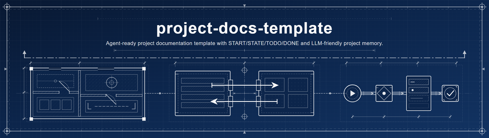
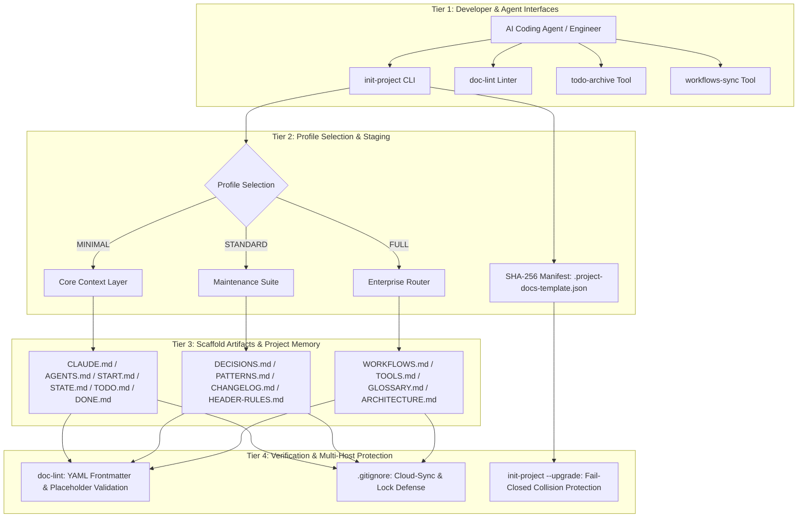
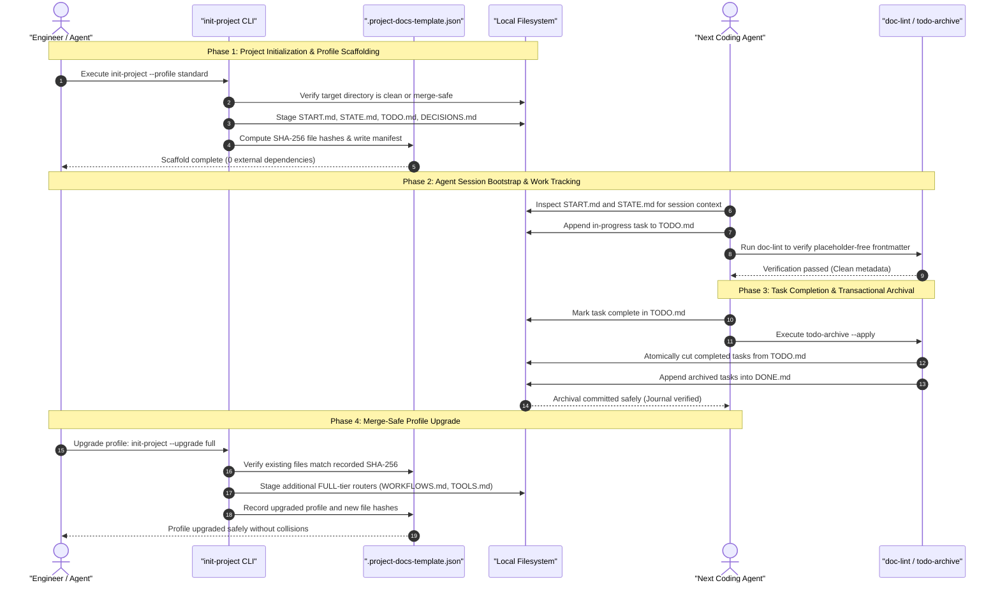

# Project Docs Template

<p align="center"></p>

[](https://github.com/ellmos-ai/project-docs-template)
[](./pyproject.toml)
[](./pyproject.toml)
[](./RELEASE_GATE.md)
[](./tests)
[](./SECURITY.md)
[](./SECURITY.md)
[](./SECURITY.md)
[](./THIRD_PARTY_LICENSES.txt)
[](./THIRD_PARTY_LICENSES.md)
[](./NOTICE)
[](https://github.com/ellmos-ai)
[](https://github.com/open-bricks)
[](./llms.txt)
[](https://github.com/ellmos-ai/project-docs-template/actions/workflows/ci.yml)
[](./README_de.md)
[](./LICENSE)
[](./MARKETING-LOG.txt)
[](./THIRD_PARTY_LICENSES.md)
[](./MARKETING-LOG.txt)

Agent-ready project documentation template with START/STATE/TODO/DONE,
workflows, lightweight tooling, and LLM-friendly project memory.

> [!NOTE]
> **AI / LLM Indexing**: AI agents and automated tools can inspect [llms.txt](llms.txt) for a machine-readable summary, search terms, and disambiguation details. Last checked: **2026-09-29**.

> Independent project — not affiliated with Anthropic, OpenAI, or Google.
> See [Trademarks](#trademarks).

### 🧭 Quick Navigation

1. [Executive Summary & Core Identity](#executive-summary--core-identity)
2. [Visual Architecture Topology & Decoupled Layers](#visual-architecture-topology)
3. [End-to-End Multi-Agent Lifecycle & Tooling Flow](#end-to-end-multi-agent-lifecycle)
4. [Target Personas & High-Intent SEO Queries](#target-personas--core-use-cases)
5. [Comparative Architecture Matrix vs. Alternatives](#comparative-matrix-vs-alternatives)
6. [Governance & Runtime Invariants Matrix](#governance--runtime-invariants)
7. [When to Use This Template](#use-this-template-when)
8. [What Is Included & Scaffold Structure](#what-is-included)
9. [Quick Start & Common CLI Workflows](#quick-start)
10. [Merge-Safe Profile Upgrades & Migration](#merge-safe-profile-upgrades)
11. [Profile Comparison Matrix (MINIMAL / STANDARD / FULL)](#profile-comparison)
12. [Design Principles & Architecture Invariants](#design-principles)
13. [Testing, Verification & Quality Gates](#verification)
14. [Security Policy & Vulnerability SLAs](#security-policy)
15. [Third-Party Licenses & Level 1 SBOM](#third-party-licenses--transparency)
16. [Bundles, Partners & Ecosystem Sibling Tools](#ecosystem--sibling-tools)
17. [Trademarks & Independence Notice](#trademarks)
18. [Statutory Notice, Liability Limitation & License (§ 521 BGB)](#license)

---

## <a id="sec-01"></a><a id="executive-summary--core-identity"></a><a id="what-is-project-docs-template"></a>1. Executive Summary & Core Identity

`project-docs-template` provides a lightweight, agent-ready documentation and project memory architecture engineered for autonomous AI coding agents (Claude Code, OpenAI Codex, Antigravity/Gemini), multi-agent swarms, and human maintainers operating across software, research, and operations repositories.

Instead of turning projects into heavyweight, rigid operating systems or relying on proprietary SaaS portals, `project-docs-template` operates through transparent, standard plain-text Markdown registers (`START.md`, `STATE.md`, `TODO.md`, `DONE.md`, `DECISIONS.md`). Universal entry contracts (`CLAUDE.md`, `AGENTS.md`) ensure that every agent bootstrapping into the workspace instantly acquires exact project state, architectural invariants, and active task items without hallucinations or context drift.

### Core Value Propositions
- **100% Local-First & Zero-Egress**: Operates entirely within local filesystem checkouts without network calls, telemetry, or external API dependencies.
- **Zero Runtime Dependencies**: Pure Python standard library (3.10+) for all scaffolding, staging, validation, and task archival tools.
- **Deterministic Multi-Agent Handoff**: Dedicated session bootstrap (`START.md`) and live status snapshot (`STATE.md`) guarantee frictionless agent-to-agent and session-to-session handoffs.
- **Merge-Safe Profile Upgrades**: SHA-256 manifest tracking (`.project-docs-template.json`) enables safe upgrades from `MINIMAL` to `STANDARD` or `FULL` without overwriting custom project code or documents.
- **Transactional Task Archival**: Atomic two-file journaling (`todo-archive`) cleanly rolls completed tasks into `DONE.md` to keep `TODO.md` focused and concise.

---

## <a id="sec-02"></a><a id="visual-architecture-topology"></a><a id="architecture--flow"></a>2. Visual Architecture Topology & Decoupled Layers

The diagram below illustrates the four decoupled operational tiers of `project-docs-template`, from developer/agent interfaces down to persistent repository state, validation gates, and cloud-sync defenses:


```mermaid
flowchart TD
    subgraph T1["Tier 1: Developer & Agent Interfaces"]
        A["AI Coding Agent / Engineer"] --> B["init-project CLI"]
        A --> C["doc-lint Linter"]
        A --> D["todo-archive Tool"]
        A --> E["workflows-sync Tool"]
    end

    subgraph T2["Tier 2: Profile Selection & Staging"]
        B --> F{"Profile Selection"}
        F -->|MINIMAL| G["Core Context Layer"]
        F -->|STANDARD| H["Maintenance Suite"]
        F -->|FULL| I["Enterprise Router"]
        B --> J["SHA-256 Manifest: .project-docs-template.json"]
    end

    subgraph T3["Tier 3: Scaffold Artifacts & Project Memory"]
        G --> K["CLAUDE.md / AGENTS.md / START.md / STATE.md / TODO.md / DONE.md"]
        H --> L["DECISIONS.md / PATTERNS.md / CHANGELOG.md / HEADER-RULES.md"]
        I --> M["WORKFLOWS.md / TOOLS.md / GLOSSARY.md / ARCHITECTURE.md"]
    end

    subgraph T4["Tier 4: Verification & Multi-Host Protection"]
        K & L & M --> N["doc-lint: YAML Frontmatter & Placeholder Validation"]
        K & L & M --> O[".gitignore: Cloud-Sync & Lock Defense"]
        J --> P["init-project --upgrade: Fail-Closed Collision Protection"]
    end
```

### Four-View Architectural Projection

```text
+--------------------------------------------------------------------------------------------------+
|                  [VIEW 1: CLI COCKPIT, LINTER & AGENT INTERFACE HARNESS]                         |
|  - init-project: Deterministic scaffolding, SHA-256 manifest stamping & profile migrations      |
|  - doc-lint: Static markdown validation, frontmatter linting & header contract enforcement       |
|  - todo-archive: Atomic two-file task ledger journaling (TODO.md -> DONE.md)                     |
|  - workflows-sync: Bidirectional orchestration synchronization & prompt template extraction      |
+--------------------------------------------------------------------------------------------------+
                                                |
                                                v
+--------------------------------------------------------------------------------------------------+
|                  [VIEW 2: TIERED PROFILE ENGINE & MERGE-SAFE STAGING]                            |
|  - MINIMAL Profile: Lightweight context boundary (CLAUDE.md, AGENTS.md, START.md, STATE.md)     |
|  - STANDARD Profile: Complete project memory (TODO.md, DONE.md, DECISIONS.md, PATTERNS.md)       |
|  - FULL Profile: Enterprise architecture & governance (WORKFLOWS.md, TOOLS.md, GLOSSARY.md)      |
|  - SHA-256 Manifest: .project-docs-template.json protects custom user edits against collisions   |
+--------------------------------------------------------------------------------------------------+
                                                |
                                                v
+--------------------------------------------------------------------------------------------------+
|                  [VIEW 3: RUNTIME PERSISTENCE, REPOSITORY MEMORY & AUDIT]                        |
|  - Universal Agent Bootstrap: CLAUDE.md / AGENTS.md instant workspace alignment                  |
|  - Session Memory: START.md (session bootloader) & STATE.md (live operational ledger)            |
|  - Task Tracking: Structured task cards, recurring checklists, and verification criteria        |
|  - Decision Ledger: ADR-style architectural records (DECISIONS.md) & code patterns (PATTERNS.md)|
+--------------------------------------------------------------------------------------------------+
                                                |
                                                v
+--------------------------------------------------------------------------------------------------+
|                  [VIEW 4: SECURITY BOUNDARY, AIR-GAP & RUNASINVOKER ZERO-EGRESS]                 |
|  - Unprivileged User-Mode: RunAsInvoker guarantee, 0 administrative elevation, 0 UAC prompts     |
|  - Zero-Egress Invariant: 100% offline, 0 network sockets, 0 phone-home calls, 0 telemetry       |
|  - Multi-Host Cloud-Sync Defense: .gitignore filters for conflict copies (*-WORKSTATION-LG*)    |
|  - Legal & Governance: § 521 BGB Gefälligkeit liability cap, 48h Security SLA (INV-SLA-10)       |
+--------------------------------------------------------------------------------------------------+
```

---

## <a id="sec-03"></a><a id="end-to-end-multi-agent-lifecycle"></a>3. End-to-End Multi-Agent Lifecycle & Tooling Flow

The sequence diagram below demonstrates how human engineers and autonomous AI coding agents interact with `project-docs-template` across scaffolding, session bootstrap, task completion, and merge-safe profile upgrades:


```mermaid
sequenceDiagram
    autonumber
    actor Engineer as "Engineer / Agent"
    participant CLI as "init-project CLI"
    participant Manifest as ".project-docs-template.json"
    participant FS as "Local Filesystem"
    actor NextAgent as "Next Coding Agent"
    participant Linter as "doc-lint / todo-archive"

    Note over Engineer,FS: Phase 1: Project Initialization & Profile Scaffolding
    Engineer->>CLI: Execute init-project --profile standard
    CLI->>FS: Verify target directory is clean or merge-safe
    CLI->>FS: Stage START.md, STATE.md, TODO.md, DECISIONS.md
    CLI->>Manifest: Compute SHA-256 file hashes & write manifest
    Manifest-->>Engineer: Scaffold complete (0 external dependencies)

    Note over Engineer,Linter: Phase 2: Agent Session Bootstrap & Work Tracking
    NextAgent->>FS: Inspect START.md and STATE.md for session context
    NextAgent->>FS: Append in-progress task to TODO.md
    NextAgent->>Linter: Run doc-lint to verify placeholder-free frontmatter
    Linter-->>NextAgent: Verification passed (Clean metadata)

    Note over NextAgent,Linter: Phase 3: Task Completion & Transactional Archival
    NextAgent->>FS: Mark task complete in TODO.md
    NextAgent->>Linter: Execute todo-archive --apply
    Linter->>FS: Atomically cut completed tasks from TODO.md
    Linter->>FS: Append archived tasks into DONE.md
    FS-->>NextAgent: Archival committed safely (Journal verified)

    Note over Engineer,NextAgent: Phase 4: Merge-Safe Profile Upgrade
    Engineer->>CLI: Upgrade profile: init-project --upgrade full
    CLI->>Manifest: Verify existing files match recorded SHA-256
    CLI->>FS: Stage additional FULL-tier routers (WORKFLOWS.md, TOOLS.md)
    CLI->>Manifest: Record upgraded profile and new file hashes
    Manifest-->>Engineer: Profile upgraded safely without collisions
```

---

## <a id="sec-04"></a><a id="target-personas--discoverability"></a><a id="target-personas--core-use-cases"></a>4. Target Personas & Core Use Cases

`project-docs-template` is engineered to solve context drift, handoff loss, and governance friction across four primary technical user journeys:

| Target Persona | Key Pain Point | How `project-docs-template` Solves It | Core Artifacts |
|:---|:---|:---|:---|
| **Multi-Agent Systems Engineers** | Heterogeneous coding agents (Claude Code, Antigravity/Gemini, Codex) lose project context between sessions and invent divergent file formats. | Universal entry point contracts (`CLAUDE.md`, `AGENTS.md`) and dedicated bootstrap/state registers (`START.md`, `STATE.md`) guarantee deterministic agent handoffs. | `CLAUDE.md`, `AGENTS.md`, `START.md`, `STATE.md` |
| **Solo Developers & Open-Source Maintainers** | Juggling issues, feature backlogs, and release histories without heavy, distracting project management SaaS (Jira, Linear). | Minimal-overhead markdown task loops (`TODO.md`, `DONE.md`) paired with a transactional archival tool (`todo-archive`) and standard `CHANGELOG.md`. | `TODO.md`, `DONE.md`, `_tools/todo-archive`, `CHANGELOG.md` |
| **Enterprise Architecture & AI Governance Leads** | Lack of auditable decision trails, compliance transparency, and risk of accidental data egress in corporate agent workflows. | Architecture Decision Records (`DECISIONS.md`), strict `SECURITY.md` local-first invariants, and zero external runtime dependencies. | `DECISIONS.md`, `SECURITY.md`, `THIRD_PARTY_LICENSES.md` |
| **Research & Scientific Pipeline Developers** | Complex multi-stage experiment pipelines drift over weeks of autonomous LLM reasoning runs. | Scalable FULL profile with operational runbooks (`WORKFLOWS.md`), domain terminology (`GLOSSARY.md`), and automated table sync (`workflows-sync`). | `WORKFLOWS.md`, `GLOSSARY.md`, `_tools/workflows-sync` |

### High-Intent Discovery Search Queries
- `agent-ready project documentation template`
- `claude code documentation scaffold`
- `multi-agent session handoff state start todo done`
- `offline local-first project template python`
- `zero-egress developer scaffolding stdlib`
- `deterministic documentation staging and profile upgrades`
- `llm friendly project memory repository template`

---

## <a id="sec-05"></a><a id="comparative-matrix-vs-alternatives"></a><a id="comparative-architecture"></a>5. Comparative Architecture Matrix vs. Alternatives

The matrix below compares `project-docs-template` against single README markdown dumps, heavy SaaS wikis, rigid agent frameworks, and ad-hoc shell scripts across our 10 Governance and Technical Invariants (`INV-LOCAL-01` to `INV-SLA-10`):

| # | Invariant & Dimension | project-docs-template | Generic Markdown Dumps | Heavy SaaS Wikis (Notion / Jira) | Rigid Agent Frameworks (CrewAI / AutoGPT) | Ad-Hoc Scripts / Folder Flags |
|---|:---|:---:|:---:|:---:|:---:|:---:|
| 1 | **INV-LOCAL-01: Zero-Egress & Local-First** | ✅ 100% Offline (Zero network calls) | ⚠️ Partial (unverified) | ❌ Cloud-only (egress mandatory) | ⚠️ Often requires external APIs | ✅ Local files |
| 2 | **INV-SEC-02: Unprivileged `RunAsInvoker`** | ✅ Non-root user space only | ✅ User space | ⚠️ Browser / SaaS auth | ⚠️ Container / service permissions | ✅ User space |
| 3 | **INV-FAIL-03: Fail-Closed Staging** | ✅ Refuses dirty/unowned targets | ❌ Silent file overwrites | ⚠️ Conflict resolution UI | ⚠️ Fragile runtime errors | ❌ Uncontrolled overwrites |
| 4 | **INV-STG-04: Transactional Upgrades** | ✅ SHA-256 Manifest rollback | ❌ None (manual copy-paste) | ❌ SaaS vendor locked | ❌ Often breaking upgrades | ❌ None |
| 5 | **INV-HANDOFF-05: Multi-Agent Handoff** | ✅ Standard `START.md` & `STATE.md` | ❌ None (monolithic text blob) | ❌ Poor API exports | ⚠️ Proprietary schemas | ⚠️ Ad-hoc notes |
| 6 | **INV-TIER-06: Tiered Scalable Profiles** | ✅ MINIMAL, STANDARD, FULL | ❌ One-size-fits-none | ⚠️ Complex manual boards | ❌ Fixed monolithic schema | ❌ Undefined |
| 7 | **INV-SYNC-07: Cloud-Sync & Lock Defense** | ✅ Root & template ignore guards | ❌ None (conflict copy accumulation) | ❌ SaaS cloud only | ❌ Unmanaged local sync | ❌ High collision risk |
| 8 | **INV-AUDIT-08: Human-Readable Archival** | ✅ `TODO.md` / `DONE.md` + journal | ❌ Bloated single TODO list | ⚠️ Opaque database entries | ⚠️ Binary / JSON state logs | ❌ Unstructured files |
| 9 | **INV-LIC-09: 100% Permissive Dependency Stack** | ✅ MIT (Zero runtime dependencies) | ✅ Markdown only | ❌ Commercial proprietary | ⚠️ Complex Python dependency tree | ⚠️ Unspecified |
| 10 | **INV-SLA-10: 48h Response / 5d Triage SLA** | ✅ Formal security SLA policy | ❌ None | ⚠️ Commercial SLA tier only | ⚠️ Community forum triage | ❌ None |

---

## <a id="sec-06"></a><a id="governance--runtime-invariants"></a>6. Governance & Runtime Invariants Matrix

`project-docs-template` guarantees 10 fundamental runtime, staging, and governance invariants across all scaffolding tools, maintenance CLI utilities, and generated repository profiles:

| Canonical ID | Invariant Title | Core Operational Guarantee |
|:---|:---|:---|
| **INV-LOCAL-01** | **100% Local-First & Zero-Egress** | Operates strictly on local filesystems. Never transmits telemetry, tracking data, or network payloads. |
| **INV-SEC-02** | **Unprivileged Execution (`RunAsInvoker`)** | Executes entirely in standard unprivileged user mode. Never requests sudo, administrator rights, or root privileges. |
| **INV-FAIL-03** | **Fail-Closed Default Semantics** | Aborts safely without modifying files when encountering collisions, dirty staging roots, or unparseable YAML frontmatter. |
| **INV-STG-04** | **Transactional & Merge-Safe Staging** | Profile upgrades verify SHA-256 hashes against `.project-docs-template.json`. Any modified or unowned file triggers a clean rollback. |
| **INV-HANDOFF-05** | **Multi-Agent Session Handoff & Memory** | Structured `START.md` and `STATE.md` files provide deterministic context recovery for AI coding agents across sessions. |
| **INV-TIER-06** | **Tiered Scalable Profiles** | Three graduated profiles (`MINIMAL`, `STANDARD`, `FULL`) balance documentation structure against maintenance overhead. |
| **INV-SYNC-07** | **Multi-Host Cloud-Sync Defense** | Both root and template `.gitignore` files filter conflict copies (`* (kopie)*`, `*-WORKSTATION*`, `*-ASUS-GEI*`) and locks. |
| **INV-AUDIT-08** | **Human-Readable Backlog & Archival** | Clean Markdown task tracking with transactional, rollback-safe completed task archival via `todo-archive`. |
| **INV-LIC-09** | **100% Permissive Audited Stack** | Zero external runtime dependencies; all development and packaging dependencies are MIT/PSFL/Apache-2.0 audited. |
| **INV-SLA-10** | **Dual Security Response SLA** | Committed 48-hour response and 5-business-day triage window via canonical security channels (`security@ellmos.ai`). |

---

## <a id="sec-07"></a><a id="use-this-template-when"></a>7. When to Use This Template

| Situation | Why it helps |
|:---|:---|
| A new project will be maintained by Claude Code, Codex, Gemini CLI, or another coding agent | Gives the agent a predictable bootstrap path and current-state file. |
| An existing repo has scattered notes, stale task files, or no handoff trail | Separates active work, completed work, decisions, patterns, and session state. |
| Multiple agents or humans need to resume work safely | Keeps instructions, current state, workflows, and tools in distinct files. |

This is a documentation and coordination template, not a runtime framework. It
is meant to sit inside ordinary software, research, or operations repositories.

---

## <a id="sec-08"></a><a id="what-is-included"></a>8. What Is Included & Scaffold Structure

- `CLAUDE.md` and `AGENTS.md` for agent instructions
- `START.md` and `STATE.md` for session bootstrap and current state
- `TODO.md` and `DONE.md` with optional archival tooling
- `DECISIONS.md`, `PATTERNS.md`, `CHANGELOG.md`, and `HEADER-RULES.md`
- Optional FULL-profile routers: `WORKFLOWS.md`, `TOOLS.md`, `GLOSSARY.md`
- Local helpers in `_tools/`, including `init-project`, `doc-lint`, `todo-archive`, and `workflows-sync`

The actual template files live in [`template/`](./template/).

---

## <a id="sec-09"></a><a id="quick-start"></a>9. Quick Start & Common CLI Workflows

Clone the repository and run the generator:

```bash
git clone https://github.com/ellmos-ai/project-docs-template.git
cd project-docs-template

# Generate standard profile in target directory
python template/_tools/init-project /path/to/my-project --profile standard

# Dry-run inspection
python template/_tools/init-project /path/to/my-project --profile full --dry-run
```

Available CLI commands in generated projects:
```bash
# Lint project documentation and verify YAML frontmatter
python _tools/doc-lint

# Archive completed tasks from TODO.md into DONE.md
python _tools/todo-archive --apply

# Synchronize workflow tables across routers
python _tools/workflows-sync --apply
```

> [!NOTE]
> **Template language:** The repository documentation is English, but the template bodies under [`template/`](./template/) — `CLAUDE.md`, `START.md`, `STATE.md`, `TODO.md` and the rest — and the CLI output of `init-project`, `doc-lint`, `todo-archive` and `workflows-sync` are written in German. The file names, profile markers and YAML front matter keys are language-neutral, so an English project can use the structure and replace the prose; an English template set is planned — see [`TODO.md`](./TODO.md).

---

## <a id="sec-10"></a><a id="merge-safe-profile-upgrades"></a>10. Merge-Safe Profile Upgrades & Migration

Existing projects can be upgraded to higher profiles safely:

```bash
# Upgrade existing project to FULL profile
python template/_tools/init-project /path/to/my-project --upgrade full
```

### Safety Guarantees During Upgrade
- **Manifest Verification**: Reads `.project-docs-template.json` to verify current profile and SHA-256 hashes.
- **Fail-Closed on Unowned Collisions**: If a file to be added already exists and was not part of the previous profile, the upgrade aborts immediately.
- **Fail-Closed on User Mutations**: If a template file was modified by the user, the upgrade refuses to overwrite it without explicit confirmation.
- **Rollback Guarantee**: In case of any I/O failure or abort, the manifest and filesystem state roll back cleanly to the prior state.

---

## <a id="sec-11"></a><a id="profile-comparison"></a>11. Profile Comparison Matrix

| Feature / Document | `MINIMAL` | `STANDARD` | `FULL` |
|:---|:---:|:---:|:---:|
| `CLAUDE.md` & `AGENTS.md` (Agent Instructions) | ✅ Included | ✅ Included | ✅ Included |
| `START.md` & `STATE.md` (Session Memory) | ✅ Included | ✅ Included | ✅ Included |
| `TODO.md` & `DONE.md` (Task Tracking) | ✅ Included | ✅ Included | ✅ Included |
| `_tools/todo-archive` (Task Archival) | ✅ Included | ✅ Included | ✅ Included |
| `_tools/doc-lint` (Documentation Linter) | ✅ Included | ✅ Included | ✅ Included |
| `DECISIONS.md` (Architecture Decisions) | — | ✅ Included | ✅ Included |
| `PATTERNS.md` (Design Patterns) | — | ✅ Included | ✅ Included |
| `CHANGELOG.md` & `HEADER-RULES.md` | — | ✅ Included | ✅ Included |
| `WORKFLOWS.md` & `_tools/workflows-sync` | — | — | ✅ Included |
| `TOOLS.md` & `GLOSSARY.md` (Domain Routers) | — | — | ✅ Included |
| `ARCHITECTURE.md` & `.github/` Workflows | — | — | ✅ Included |

---

## <a id="sec-12"></a><a id="design-principles"></a>12. Design Principles & Architecture Invariants

- **Separation of Concerns**: Every file has a single, well-defined operational responsibility.
- **Explicit Session Handoff**: Session start and current state are documented in short, predictable files (`START.md`, `STATE.md`).
- **Low Maintenance Burden**: Focuses on high-value context documents rather than generating sprawling, unmaintained wikis.
- **Router Pattern**: High-level routers (`WORKFLOWS.md`, `TOOLS.md`) index details rather than duplicating them.
- **Transactional Task Lifecycle**: Completed tasks are pruned into `DONE.md` atomically instead of bloating the active task backlog.

See [`template/TEMPLATE.md`](./template/TEMPLATE.md) for the complete design rationale.

---

## <a id="sec-13"></a><a id="verification"></a>13. Testing, Verification & Quality Gates

The entire test suite can be run with Python's standard `unittest` or `pytest`:

```bash
# Run test suite via pytest
pytest -ra -v

# Run test suite via standard unittest
python -m unittest discover -s tests -v
```

The test suite exercises every profile, real Git repository initialization, frontmatter repair, workflow metadata escaping, and transactional TODO/DONE rollback behavior. The same suite runs across Linux, Windows, and macOS; see [`RELEASE_GATE.md`](./RELEASE_GATE.md).

---

## <a id="sec-14"></a><a id="security-policy"></a>14. Security Policy & Vulnerability SLAs

`project-docs-template` enforces strict security invariants:
- **Zero-Egress Invariant**: All scaffolding and maintenance operations execute offline with zero network connectivity.
- **Deterministic Staging**: Scaffolds and profile upgrades perform safe staging and abort cleanly upon collisions.
- **Dual Security SLAs**: Committed **48-hour response** and **5-business-day triage** window.

Security reports must be sent through private channels as documented in [`SECURITY.md`](./SECURITY.md) (`security@ellmos.ai`, `security@open-bricks.org`, `support@lukasgeiger.com`), never via public issues.

---

## <a id="sec-15"></a><a id="third-party-licenses--transparency"></a>15. Third-Party Licenses & Level 1 SBOM

`project-docs-template` maintains a **strict Zero-Runtime-Dependency architecture** (`dependencies = []`). All runtime code relies exclusively on Python's standard library (3.10+).

| Component | Scope | Declared License | Status |
|:---|:---|:---|:---|
| **Python Standard Library** | Core Runtime | PSFL-2.0 | 100% Permissive (Built-in) |
| **pytest** | Development / Test | MIT License | 100% Permissive |
| **ruff** | Development / QA | MIT / Apache-2.0 | 100% Permissive |
| **setuptools** | Build Backend | MIT License | 100% Permissive |

For the complete Level 1 Software Bill of Materials (SBOM), audited dependency matrix, and Invariant Cross-Reference Matrix (`INV-LOCAL-01` to `INV-SLA-10`), see [THIRD_PARTY_LICENSES.md](THIRD_PARTY_LICENSES.md) and the plain-text companion [THIRD_PARTY_LICENSES.txt](THIRD_PARTY_LICENSES.txt).

---

## <a id="sec-16"></a><a id="ecosystem--sibling-tools"></a><a id="bundles-and-partners"></a>16. Bundles, Partners & Ecosystem Sibling Tools

`project-docs-template` is an essential scaffolding component within the [`ellmos-ai`](https://github.com/ellmos-ai) ecosystem and the umbrella [`open-bricks`](https://github.com/open-bricks) open-source collective:

| Repository | Purpose | Primary Surface |
|:---|:---|:---|
| [`policy-registry`](https://github.com/ellmos-ai/policy-registry) | Machine-readable policy registry with signed delegations | CLI / API / MCP |
| [`DevCenter`](https://github.com/dev-bricks/DevCenter) | Local-first Python IDE and developer toolkit | GUI / PySide6 |
| [`CodeBox`](https://github.com/dev-bricks/CodeBox) | Isolated code playground and execution environment | GUI / CLI |
| [`companion-for-agy`](https://github.com/ellmos-ai/companion-for-agy) | Extension & companion suite for Antigravity AI agents | CLI / Node.js |
| [`safe-start-for-codex`](https://github.com/dev-bricks/safe-start-for-codex) | Defensive bootstrapping and environment verifier | CLI / Python |
| [`automizer-for-claude-desktop`](https://github.com/dev-bricks/automizer-for-claude-desktop) | Bridge & automation toolkit for Claude Desktop | CLI / Python |
| [`system-gap-master`](https://github.com/ellmos-ai/system-gap-master) | Cross-system sync & divergence analyzer | CLI / Python |
| [`lock-master`](https://github.com/ellmos-ai/lock-master) | File & resource concurrency lock manager | CLI / Python |
| [`ticket-master`](https://github.com/ellmos-ai/ticket-master) | Local-first issue & ticketing orchestrator | CLI / Python |
| [`clutch`](https://github.com/ellmos-ai/clutch) | Provider-neutral LLM router and model orchestration engine | CLI / Python |
| [`memoryhooker`](https://github.com/ellmos-ai/memoryhooker) | Session memory extraction & hook injector | CLI / Python |
| [`workflowhooker`](https://github.com/ellmos-ai/workflowhooker) | Workflow automation lifecycle triggers | CLI / Python |
| [`ellmos-controlcenter-mcp`](https://github.com/ellmos-ai/ellmos-controlcenter-mcp) | MCP server for system inspection and skill discovery | MCP / Python |
| [`ellmos-filecommander-mcp`](https://github.com/ellmos-ai/ellmos-filecommander-mcp) | MCP server for safe local file operations | MCP / Python |
| [`open-bricks`](https://github.com/open-bricks) | Umbrella organization for developer & AI tools | Portal |

<!-- BEGIN GENERATED ELLMOS BUNDLE DISCOVERY -->
### Bundles and Partners Discovery Projection
Generated discovery projection for `module:project-docs-template` from `catalog:v4-bundles` (`546290dafbaafd810df1d59ef5a3d7183738472b48cd5a8a81f1e8f2b64d852e`). Target repository visibility: `public`.

- **`ellmos-dev-lifecycle-bundle`**: role `declared-component`, requirement `required`. Partners: `module:bundle-installer`, `module:ellmos-code-tools`, `module:ellmos-tests`, `module:github-onedrive-mirror`, `module:stack-system-installer`.
- **`ellmos-knowledge-bundle`**: role `declared-component`, requirement `recommended`. Partners: `module:KnowledgeDigest`, `module:WikiStub-Seed`, `module:report-forge`, `module:web-scraper`.
<!-- END GENERATED ELLMOS BUNDLE DISCOVERY -->

---

## <a id="sec-17"></a><a id="trademarks"></a>17. Trademarks & Independence Notice

This project is an independent, community-maintained documentation template.
It is **not** affiliated with, endorsed by, sponsored by, or otherwise connected
to Anthropic, OpenAI, or Google.

"Claude" and "Claude Code", "Codex", "Gemini" and "Antigravity" are trademarks
or registered trademarks of their respective owners (Anthropic PBC, OpenAI,
Google LLC). All other product names, logos, and brands are the property of
their respective owners. They are used here solely to describe compatibility
and interoperability, and their use does not imply any endorsement,
authorisation, or business relationship.

---

## <a id="sec-18"></a><a id="license"></a><a id="statutory-notice-liability-limitation--license"></a>18. Statutory Notice, Liability Limitation & License (§ 521 BGB)

### Statutory Notice & Limitation of Liability (§ 521 BGB)
The provision of this software and template scaffold is made free of charge as a statutory courtesy (*Gefälligkeit* / *unentgeltliche Schenkung* pursuant to **§ 521 BGB** of the German Civil Code). Under German statutory law, liability of the author and contributors is strictly limited to intent and gross negligence (*Vorsatz und grobe Fahrlässigkeit*). Mandatory statutory liability — in particular for intent (Section 276(3) BGB) and for injury to life, body, or health — remains unaffected.

### License
This project is licensed under the terms of the **MIT License**. See [LICENSE](LICENSE) and [NOTICE](NOTICE) for complete copyright attribution.
