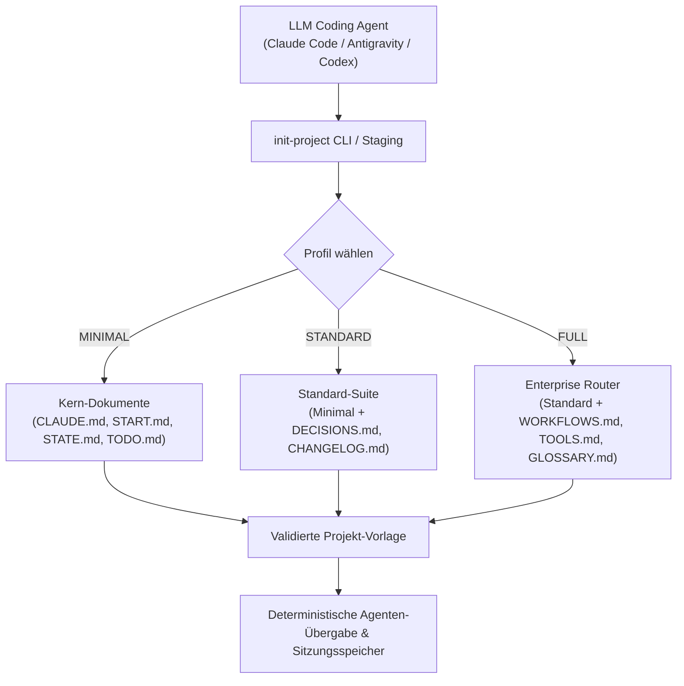
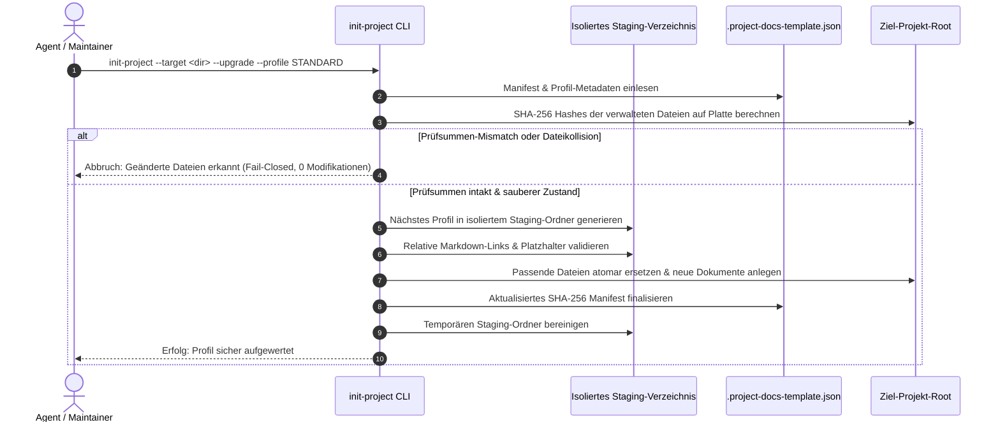

# Project Docs Template (Deutsche Dokumentation)

[](https://github.com/ellmos-ai/project-docs-template)
[](./pyproject.toml)
[](./pyproject.toml)
[](./RELEASE_GATE.md)
[](./tests)
[](./SECURITY.md)
[](./SECURITY.md)
[](https://github.com/ellmos-ai)
[](https://github.com/open-bricks)
[](./llms.txt)
[](https://github.com/ellmos-ai/project-docs-template/actions/workflows/ci.yml)
[](./README.md)
[](./LICENSE)

Agenten-optimierte Projektdokumentations-Vorlage mit START/STATE/TODO/DONE,
Workflows, leichtgewichtigen Tools und KI-freundlichem Projektgedächtnis.

> [!NOTE]
> Dieses Repository ist maschinenlesbar und für KI-Agenten optimiert. KI-Coding-Assistenten (Claude Code, Antigravity/Gemini, Codex) können [`llms.txt`](./llms.txt) als schnellen Kontext-Index nutzen und `pytest` (34 bestandene Tests, 7 Subtests) ausführen, um die Integrität der Vorlagengenerierung und Profil-Upgrades zu überprüfen.

> Unabhängiges Projekt — keine Verbindung zu Anthropic, OpenAI oder Google.
> Siehe [Marken](#marken).

Dieses Repository enthält ein kompaktes Dokumentations-Scaffold für Software-, Forschungs- und Betriebsprojekte, die mit LLM-Agenten gepflegt werden. Die Vorlage konzentriert sich auf klaren Projektstatus, Übergaben zwischen Sitzungen, Aufgabenhistorie, Entscheidungsaufzeichnungen und Workflows, ohne das Projekt in ein schwerfälliges Betriebssystem zu verwandeln.

## Architektur & Ablauf



## Verwendungsszenarien

| Situation | Vorteil |
|---|---|
| Ein neues Projekt wird von Claude Code, Codex, Gemini CLI oder einem anderen Agenten betreut | Bietet dem Agenten einen vorhersehbaren Bootstrap-Pfad und eine aktuelle Statusdatei. |
| Ein bestehendes Repo hat verstreute Notizen oder keine Übergabespur | Trennt aktive Arbeit, abgeschlossene Arbeit, Entscheidungen und Sitzungsstatus sauber. |
| Mehrere Agenten oder Entwickler müssen die Arbeit sicher fortsetzen | Hält Anweisungen, Status, Workflows und Tools in dedizierten Dateien. |

## Was enthalten ist

- `CLAUDE.md` und `AGENTS.md` für Agenten-Anweisungen
- `START.md` und `STATE.md` für den Sitzungs-Bootstrap und den aktuellen Status
- `TODO.md` und `DONE.md` mit optionaler Archivierungsunterstützung
- `DECISIONS.md`, `PATTERNS.md`, `CHANGELOG.md` und `HEADER-RULES.md`
- Optionale FULL-Profil-Router: `WORKFLOWS.md`, `TOOLS.md`, `GLOSSARY.md`
- Lokale Helfer unter `_tools/`, darunter `init-project`, `doc-lint`, `todo-archive` und `workflows-sync`

Die eigentlichen Vorlagendateien befinden sich in [`template/`](./template/).

## Schnellstart

Repository klonen und ein Projektprofil instanziieren:

```bash
git clone https://github.com/ellmos-ai/project-docs-template.git
cd project-docs-template
python template/_tools/init-project --target ../mein-projekt --name MeinProjekt --profile STANDARD
```

Optionale Flag `--author "Ihr Name"` zur Festlegung des Autors oder `--git` zur Erstellung eines `main`-Repositories mit Initial-Commit.

### Merge-sichere Profil-Upgrades

Jedes generierte Projekt erhält `.project-docs-template.json` mit dem Profil
und SHA-256-Hashes der vom Generator verwalteten Dateien. Das nächste Profil
wird ausdrücklich und schrittweise angefordert:

```bash
python template/_tools/init-project --target ../mein-projekt \
  --profile STANDARD --upgrade
```

Der Upgrade-Ablauf folgt einem strikten Staging- und Validierungs-Lebenszyklus:



Der Befehl baut das Zielprofil zunächst in einem Staging-Ordner. Er ersetzt
nur Dateien, deren Manifest-Hash noch stimmt, legt nur fehlende Profil-Dateien
an und schreibt das Manifest zuletzt. Geänderte verwaltete Dateien,
unbekannte Dateikollisionen, ein fehlendes Manifest oder ein übersprungener
Profil-Schritt führen vor jeder Änderung zum Abbruch. Es gibt keinen
automatischen Merge; eigene Änderungen müssen bewusst aufgelöst werden.
Mit `--dry-run` lässt sich der Plan ohne Schreibvorgang anzeigen.

Verfügbare Profile:

- `MINIMAL`: 7 Stammdateien plus essentielle Werkzeuge
- `STANDARD`: 12 Stammdateien plus Entscheidungen & Changelog
- `FULL`: 16 Stammdateien plus Workflow-, Tool- und Glossar-Router

Alternativ können einzelne Dateien auch manuell aus [`template/`](./template/)
kopiert werden, wenn nur ausgewählte Teile benötigt werden.

Erfordert Python 3.10 oder neuer. Git wird nur für `--git` benötigt.

> [!IMPORTANT]
> Dieses Paket ist **nicht** auf PyPI veröffentlicht. Die `pyproject.toml` dient
> ausschließlich lokalen Werkzeugen und Metadaten. Die Installation erfolgt
> durch Klonen dieses Repositories — führen Sie **nicht** `pip install
> project-docs-template` aus; ein Paket dieses Namens in einem öffentlichen
> Index stammt nicht von uns.

> [!IMPORTANT]
> **Die erzeugte Dokumentation ist derzeit deutsch.** Die Vorlagen unter
> [`template/`](./template/) — `CLAUDE.md`, `START.md`, `STATE.md`, `TODO.md`
> und die übrigen — sowie die CLI-Ausgaben von `init-project`, `doc-lint`,
> `todo-archive` und `workflows-sync` sind auf Deutsch verfasst, während sich
> das Repository selbst englisch präsentiert. Dateinamen, Profil-Marker und
> YAML-Schlüssel sind sprachneutral; eine Sprachumschaltung gibt es noch nicht.
> Ein englischer Vorlagensatz ist vorgesehen — siehe [`TODO.md`](./TODO.md).

## Profil-Vergleich

| Profil | Bestes Szenario | Kopierte Dateien |
|---|---|---|
| `MINIMAL` | Kleine Repos, Experimente, kurze Tools | Core Agenten-Instruktionen, Start/State, TODO/DONE, Basis-Tools |
| `STANDARD` | Ernsthafte Projekte mit Entscheidungs- & Pflegebedarf | Minimal-Set plus Changelog, Entscheidungen, Muster & Regeln |
| `FULL` | Multi-Agenten- & Langzeitprojekte mit Routern & Workflows | Standard-Set plus Architektur, Workflow/Tool-Router & Glossar |

## Design-Prinzipien

- Jede Datei hat eine klar abgegrenzte Aufgabe.
- Die Übergabe zwischen Sitzungen ist explizit und kurz.
- Der Pflegeaufwand zählt mehr als die Vollständigkeit aller denkbaren Dokumente.
- Router wie `WORKFLOWS.md` und `TOOLS.md` verweisen auf Details an anderer Stelle.
- Abgeschlossene Aufgaben können automatisch archiviert werden, statt `TODO.md` aufzublähen.

Die vollständige Begründung und eine Erklärung Datei für Datei bietet
[`template/TEMPLATE.md`](./template/TEMPLATE.md).

## Verifizierung

```bash
python -m unittest discover -s tests -v
```

Die Testsuite prüft alle Profile, reale Git-Initialisierung, Frontmatter-Reparatur und TODO/DONE Rollback-Verhalten auf Windows, Linux und macOS; siehe [`RELEASE_GATE.md`](./RELEASE_GATE.md).

Sicherheitsmeldungen gehören in den privaten Kanal, der in
[`SECURITY.md`](./SECURITY.md) beschrieben ist, nicht in öffentliche Issues.

<!-- BEGIN ELLMOS BUNDLE DISCOVERY DE -->

## Bundles und Partner

Geprüfte Discovery-Projektion für `module:project-docs-template` aus
`catalog:v4-bundles`
(`546290dafbaafd810df1d59ef5a3d7183738472b48cd5a8a81f1e8f2b64d852e`).
Das Ziel-Repository ist `public`. Die Bundle-Manifeste bleiben die Autorität
für Mitgliedschaften; dieser Abschnitt installiert oder aktiviert keine
Komponenten. Die Freigabe beruht auf einem öffentlichen Modul-Registry-Eintrag
und einer ausdrücklichen Default-deny-Allowlist für Bundles.

### `ellmos-dev-lifecycle-bundle`

- Sichtbarkeit des Bundle-Rezepts: `private`; Rolle: `declared-component`;
  Anforderung: `required`.
- Modulpartner: `module:bundle-installer`, `module:ellmos-code-tools`,
  `module:ellmos-tests`, `module:github-onedrive-mirror`,
  `module:stack-system-installer`.
- Skill-Partner: `skill:bugfix-protocol`, `skill:bugsweep`, `skill:dev-cycle`,
  `skill:encoding-fix`, `skill:github-repo-care`, `skill:migrate-rename`,
  `skill:nulcleaner`, `skill:pipeline-optimizer`, `skill:plugin-system`,
  `skill:project-onboarding`, `skill:trampelpfadanalyse`.

### `ellmos-knowledge-bundle`

- Sichtbarkeit des Bundle-Rezepts: `private`; Rolle: `declared-component`;
  Anforderung: `recommended`.
- Modulpartner: `module:KnowledgeDigest`, `module:WikiStub-Seed`,
  `module:report-forge`, `module:web-scraper`.
- Skill-Partner: `skill:bilingual-doc-sync`, `skill:docs-analysis`,
  `skill:document-chunker`.

Kompositions- und Runtime-Details werden bewusst nicht offengelegt.

<!-- END ELLMOS BUNDLE DISCOVERY DE -->

## Auffindbarkeit (SEO)

> Unabhängiges Projekt — keine Verbindung zu Anthropic, OpenAI oder Google.
> Siehe [Marken](#marken).

Suchbegriffe:

```text
agent-ready project documentation template
LLM project docs template START STATE TODO DONE
Claude Code Codex project documentation scaffold
multi-agent repo handoff documentation template
```

Für crawler- und LLM-orientierte Metadaten siehe [`llms.txt`](./llms.txt).

## Ökosystem & Geschwisterwerkzeuge

`project-docs-template` ist Teil der Open-Source-Ökosysteme [`ellmos-ai`](https://github.com/ellmos-ai), [`dev-bricks`](https://github.com/dev-bricks) und [`open-bricks`](https://github.com/open-bricks).

| Repository | Zweck | Primäre Schnittstelle |
|---|---|---|
| [`policy-registry`](https://github.com/ellmos-ai/policy-registry) | Maschinenlesbare Policy-Registry mit signierten Delegationen | CLI / API / MCP |
| [`DevCenter`](https://github.com/dev-bricks/DevCenter) | Lokale Python-IDE und Entwickler-Werkzeugkasten | GUI / PySide6 |
| [`CodeBox`](https://github.com/dev-bricks/CodeBox) | Isolierte Code-Playground- & Ausführungsumgebung | GUI / CLI |
| [`companion-for-agy`](https://github.com/ellmos-ai/companion-for-agy) | Erweiterungs- & Begleitsystem für Antigravity-Agenten | CLI / Node.js |
| [`safe-start-for-codex`](https://github.com/dev-bricks/safe-start-for-codex) | Defensiver Bootstrapper und Umgebungsverifizierer | CLI / Python |
| [`automizer-for-claude-desktop`](https://github.com/dev-bricks/automizer-for-claude-desktop) | Bridge- & Automatisierungs-Toolkit für Claude Desktop | CLI / Python |
| [`system-gap-master`](https://github.com/ellmos-ai/system-gap-master) | Cross-System-Synchronisations- & Divergenz-Prüfer | CLI / Python |
| [`lock-master`](https://github.com/ellmos-ai/lock-master) | Datei- & Ressourcen-Nebenläufigkeits-Sperren | CLI / Python |
| [`ticket-master`](https://github.com/ellmos-ai/ticket-master) | Lokaler Issue- & Ticket-Orchestrator | CLI / Python |
| [`clutch`](https://github.com/ellmos-ai/clutch) | Anbieterneutraler LLM-Router und Modell-Orchestrierung | CLI / Python |
| [`memoryhooker`](https://github.com/ellmos-ai/memoryhooker) | Sitzungsspeicher-Extraktor & Hook-Injektor | CLI / Python |
| [`workflowhooker`](https://github.com/ellmos-ai/workflowhooker) | Workflow-Automatisierungs-Lebenszyklus-Trigger | CLI / Python |
| [`ellmos-controlcenter-mcp`](https://github.com/ellmos-ai/ellmos-controlcenter-mcp) | MCP-Server für Systeminspektion & Skill-Discovery | MCP / Python |
| [`ellmos-filecommander-mcp`](https://github.com/ellmos-ai/ellmos-filecommander-mcp) | MCP-Server für sichere lokale Dateioperationen | MCP / Python |
| [`open-bricks`](https://github.com/open-bricks) | Dachorganisation für Entwickler- & KI-Werkzeuge | Portal |

## Marken

Dieses Projekt ist eine unabhängige Dokumentations-Vorlage. Es steht in **keiner**
Verbindung zu Anthropic, OpenAI oder Google und wird von diesen weder
unterstützt noch autorisiert oder gesponsert.

„Claude" und „Claude Code", „Codex", „Gemini" und „Antigravity" sind Marken bzw.
eingetragene Marken der jeweiligen Inhaber (Anthropic PBC, OpenAI, Google LLC).
Alle weiteren Produktnamen, Logos und Marken sind Eigentum der jeweiligen
Inhaber. Die Nennung erfolgt ausschließlich beschreibend, um Kompatibilität und
Zusammenspiel zu erläutern (§ 23 Abs. 1 Nr. 2 und 3 MarkenG). Sie begründet
weder eine geschäftliche Verbindung noch eine Empfehlung durch die
Markeninhaber.

## Lizenz

MIT Lizenz. Siehe [LICENSE](./LICENSE).

Dieses Projekt ist ein unentgeltlicher Open-Source-Beitrag. Es gilt die
MIT-Lizenz. Soweit deutsches Recht anwendbar ist und die Überlassung als
Schenkung zu qualifizieren ist, ist die Haftung nach § 521 BGB auf Vorsatz und
grobe Fahrlässigkeit beschränkt. Zwingende gesetzliche Haftung — insbesondere
für Vorsatz (§ 276 Abs. 3 BGB) sowie für die Verletzung von Leben, Körper oder
Gesundheit — bleibt unberührt und wird durch den Haftungsausschluss der
MIT-Lizenz nicht abbedungen. Die Nutzung erfolgt auf eigene Gefahr. Eine
Gewährleistung, Wartungs- oder Verfügbarkeitsgarantie oder eine Zusicherung der
Eignung für einen bestimmten Zweck wird nicht übernommen.

