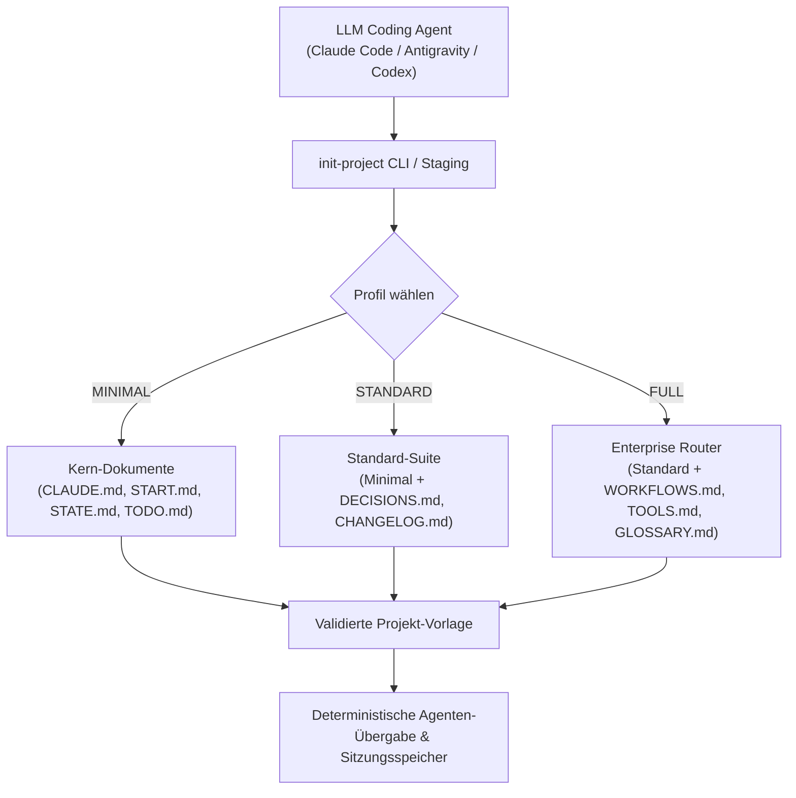

# Project Docs Template (Deutsche Dokumentation)

[](https://github.com/ellmos-ai/project-docs-template)
[](https://github.com/ellmos-ai/project-docs-template/actions/workflows/ci.yml)
[](./tests/test_tools.py)
[](./README.md)
[](./LICENSE)

Agenten-optimierte Projektdokumentations-Vorlage mit START/STATE/TODO/DONE,
Workflows, leichtgewichtigen Tools und KI-freundlichem Projektgedächtnis.

> [!NOTE]
> Dieses Repository ist maschinenlesbar und für KI-Agenten optimiert. KI-Coding-Assistenten (Claude Code, Antigravity/Gemini, Codex) können [`llms.txt`](./llms.txt) als schnellen Kontext-Index nutzen und `pytest` (18 bestandene Tests) ausführen, um die Integrität der Vorlagengenerierung zu überprüfen.

Dieses Repository enthält ein kompaktes Dokumentations-Scaffold für Software-, Forschungs- und Betriebsprojekte, die mit LLM-Agenten gepflegt werden. Die Vorlage konzentriert sich auf klaren Projektstatus, Übergaben zwischen Sitzungen, Aufgabenhistorie, Entscheidungsaufzeichnungen und Workflows, ohne das Projekt in ein schwerfälliges Betriebssystem zu verwandeln.

## Architektur & Ablauf



## Verwendungsszenarien

| Situation | Vorteil |
|---|---|
| Ein neues Projekt wird von Claude Code, Codex, Gemini CLI oder einem anderen Agenten betreut | Bietet dem Agenten einen vorhersehbaren Bootstrap-Pfad und eine aktuelle Statusdatei. |
| Ein bestehendes Repo hat verstreute Notizen oder keine Übergabespur | Trennt aktive Arbeit, abgeschlossene Arbeit, Entscheidungen und Sitzungsstatus sauber. |
| Mehrere Agenten oder Entwickler müssen die Arbeit sicher fortsetzen | Hält Anweisungen, Status, Workflows und Tools in dedizierten Dateien. |

## Was enthalten ist

- `CLAUDE.md` und `AGENTS.md` für Agenten-Anweisungen
- `START.md` und `STATE.md` für den Sitzungs-Bootstrap und den aktuellen Status
- `TODO.md` und `DONE.md` mit optionaler Archivierungsunterstützung
- `DECISIONS.md`, `PATTERNS.md`, `CHANGELOG.md` und `HEADER-RULES.md`
- Optionale FULL-Profil-Router: `WORKFLOWS.md`, `TOOLS.md`, `GLOSSARY.md`
- Lokale Helfer unter `_tools/`, darunter `init-project`, `doc-lint`, `todo-archive` und `workflows-sync`

Die eigentlichen Vorlagendateien befinden sich in [`template/`](./template/).

## Schnellstart

Repository klonen und ein Projektprofil instanziieren:

```bash
git clone https://github.com/ellmos-ai/project-docs-template.git
cd project-docs-template
python template/_tools/init-project --target ../mein-projekt --name MeinProjekt --profile STANDARD
```

Optionale Flag `--author "Ihr Name"` zur Festlegung des Autors oder `--git` zur Erstellung eines `main`-Repositories mit Initial-Commit.

Verfügbare Profile:

- `MINIMAL`: 7 Stammdateien plus essentielle Werkzeuge
- `STANDARD`: 12 Stammdateien plus Entscheidungen & Changelog
- `FULL`: 16 Stammdateien plus Workflow-, Tool- und Glossar-Router

Erfordert Python 3.10 oder neuer.

## Profil-Vergleich

| Profil | Bestes Szenario | Kopierte Dateien |
|---|---|---|
| `MINIMAL` | Kleine Repos, Experimente, kurze Tools | Core Agenten-Instruktionen, Start/State, TODO/DONE, Basis-Tools |
| `STANDARD` | Ernsthafte Projekte mit Entscheidungs- & Pflegebedarf | Minimal-Set plus Changelog, Entscheidungen, Muster & Regeln |
| `FULL` | Multi-Agenten- & Langzeitprojekte mit Routern & Workflows | Standard-Set plus Architektur, Workflow/Tool-Router & Glossar |

## Verifizierung

```bash
python -m unittest discover -s tests -v
```

Die Testsuite prüft alle Profile, reale Git-Initialisierung, Frontmatter-Reparatur und TODO/DONE Rollback-Verhalten auf Windows, Linux und macOS.

## Auffindbarkeit (SEO)

Suchbegriffe:

```text
agent-ready project documentation template
LLM project docs template START STATE TODO DONE
Claude Code Codex project documentation scaffold
multi-agent repo handoff documentation template
```

Für crawler- und LLM-orientierte Metadaten siehe [`llms.txt`](./llms.txt).

## Lizenz

MIT Lizenz. Siehe [LICENSE](./LICENSE).

Dieses Projekt ist eine unentgeltliche Open-Source-Spende. Die Haftung ist gemäß § 521 BGB auf Vorsatz und grobe Fahrlässigkeit beschränkt. Die Nutzung erfolgt auf eigene Gefahr.
