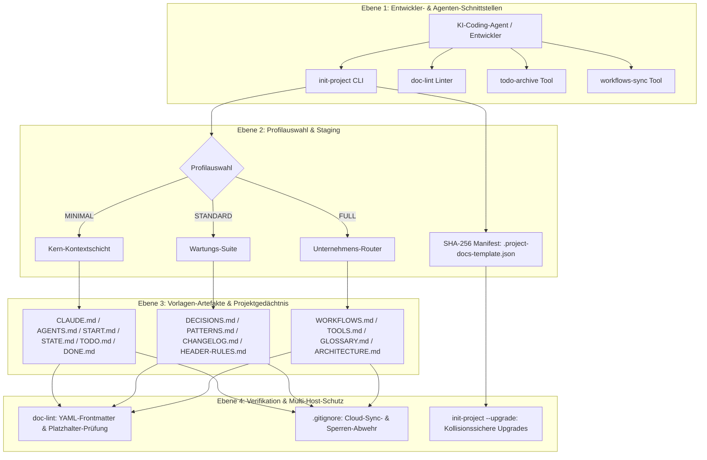
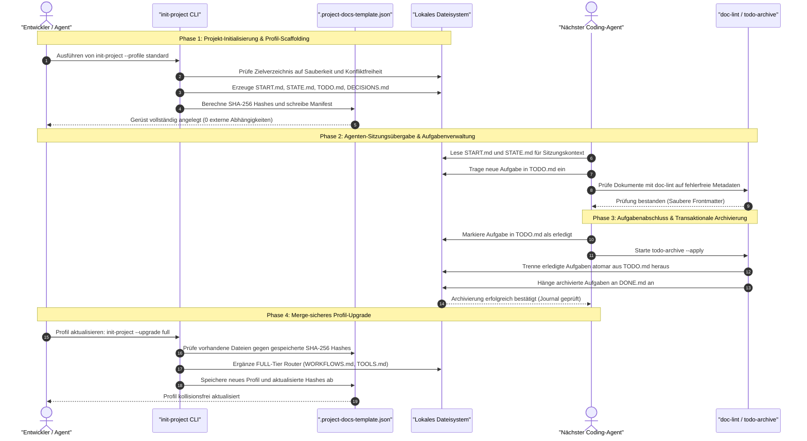

# Project Docs Template (Deutsche Dokumentation)

<p align="center"></p>

[](https://github.com/ellmos-ai/project-docs-template)
[](./pyproject.toml)
[](./pyproject.toml)
[](./RELEASE_GATE.md)
[](./tests)
[](./SECURITY.md)
[](./SECURITY.md)
[](./SECURITY.md)
[](./THIRD_PARTY_LICENSES.txt)
[](./THIRD_PARTY_LICENSES.md)
[](./NOTICE)
[](https://github.com/ellmos-ai)
[](https://github.com/open-bricks)
[](./llms.txt)
[](https://github.com/ellmos-ai/project-docs-template/actions/workflows/ci.yml)
[](./README.md)
[](./LICENSE)
[](./MARKETING-LOG.txt)
[](./THIRD_PARTY_LICENSES.md)
[](./MARKETING-LOG.txt)

Agenten-optimierte Projektdokumentations-Vorlage mit START/STATE/TODO/DONE,
Workflows, leichtgewichtigen Tools und KI-freundlichem Projektgedächtnis.

> [!NOTE]
> **KI / LLM-Indexierung**: KI-Agenten und automatisierte Werkzeuge können [llms.txt](llms.txt) für eine maschinenlesbare Übersicht, Suchbegriffe und Disambiguierung einsehen. Letzte Prüfung: **2026-09-29**.

> Unabhängiges Projekt — keine geschäftliche Verbindung zu Anthropic, OpenAI oder Google.
> Siehe [Marken](#marken).

### 🧭 Schnellnavigation

1. [Management-Zusammenfassung & Kernidentität](#management-zusammenfassung--kernidentitaet)
2. [Visuelle Architektur-Topologie & Entkoppelte Schichten](#visuelle-architektur-topologie)
3. [Ende-zu-Ende Multi-Agenten-Lebenszyklus & Tooling-Ablauf](#ende-zu-ende-lebenszyklus)
4. [Zielgruppen & High-Intent SEO-Suchanfragen](#zielgruppen--kern-anwendungsfaelle)
5. [Vergleichsmatrix gegenüber Alternativen](#vergleichsmatrix-gegenueber-alternativen)
6. [Governance & Laufzeit-Invarianten Matrix](#governance--laufzeit-invarianten)
7. [Einsatzszenarien für diese Vorlage](#verwendungsszenarien)
8. [Lieferumfang & Scaffold-Struktur](#was-enthalten-ist)
9. [Schnellstart & CLI-Workflows](#schnellstart)
10. [Merge-sichere Profil-Upgrades & Migration](#merge-sichere-profil-upgrades)
11. [Profilvergleich (MINIMAL / STANDARD / FULL)](#profil-vergleich)
12. [Design-Prinzipien & Architektur-Invarianten](#design-prinzipien)
13. [Verifikation, Tests & Qualitäts-Gates](#verifizierung)
14. [Sicherheitsrichtlinie & Schwachstellen-SLAs](#sicherheitsrichtlinie)
15. [Drittanbieter-Lizenzen & Level 1 SBOM](#drittanbieter-lizenzen--transparenz)
16. [Bundles, Partner & Ökosystem-Geschwister](#oekosystem--geschwistertools)
17. [Markenhinweise & Unabhängigkeitserklärung](#marken)
18. [Gesetzliche Hinweise, Haftungsbeschränkung & Lizenz (§ 521 BGB)](#lizenz)

---

## <a id="sec-01"></a><a id="management-zusammenfassung--kernidentitaet"></a><a id="was-ist-project-docs-template"></a>1. Management-Zusammenfassung & Kernidentität

`project-docs-template` liefert eine schlanke, agentenfähige Dokumentations- und Kontext-Architektur, konzipiert für autonome KI-Coding-Agenten (Claude Code, OpenAI Codex, Antigravity/Gemini), Multi-Agenten-Schwärme sowie menschliche Maintainer in Software-, Forschungs- und Betriebsprojekten.

Statt Repositories in schwerfällige, unübersichtliche Betriebssysteme zu verwandeln oder proprietäre SaaS-Portale vorauszusetzen, setzt `project-docs-template` auf transparente, strukturierte Klartext-Markdown-Register (`START.md`, `STATE.md`, `TODO.md`, `DONE.md`, `DECISIONS.md`). Universelle Instruktions-Einstiegspunkte (`CLAUDE.md`, `AGENTS.md`) garantieren, dass jeder neue Agent beim Sitzungsstart sofort den exakten Projektzustand, architektonische Invarianten und anstehende Aufgaben erfasst — ohne Halluzinationen oder Kontextverlust.

### Zentrale Nutzenversprechen
- **100% Local-First & Zero-Egress**: Vollständig offline im lokalen Dateisystem lauffähig, ohne externe Netzaufrufe, Telemetrie oder Cloud-Zwänge.
- **Zero Runtime Dependencies**: Reine Python-Standardbibliothek (3.10+) für sämtliche Generierungs-, Upgrade-, Validierungs- und Archivierungswerkzeuge.
- **Deterministische Multi-Agenten-Übergabe**: Dedizierte Bootstrap- (`START.md`) und Live-Statusregister (`STATE.md`) sichern reibungslose Übergaben zwischen Sitzungen und Agenten.
- **Merge-sichere Profil-Upgrades**: SHA-256-Hash-Prüfung (`.project-docs-template.json`) ermöglicht nahtlose Upgrades von `MINIMAL` auf `STANDARD` oder `FULL`, ohne eigene Projektdateien zu überschreiben.
- **Transaktionale Aufgabenarchivierung**: Atomare Zwei-Dateien-Archivierung (`todo-archive`) verschiebt erledigte Aufgaben sauber nach `DONE.md`, um `TODO.md` fokussiert und kurz zu halten.

---

## <a id="sec-02"></a><a id="visuelle-architektur-topologie"></a><a id="architektur--ablauf"></a>2. Visuelle Architektur-Topologie & Entkoppelte Schichten

Das folgende Diagramm zeigt die vier entkoppelten Betriebsebenen von `project-docs-template`, von Schnittstellen für Entwickler und Agenten bis hin zum persistenten Repository-Zustand und den Cloud-Sync-Schutzmechanismen:


```mermaid
flowchart TD
    subgraph T1["Ebene 1: Entwickler- & Agenten-Schnittstellen"]
        A["KI-Coding-Agent / Entwickler"] --> B["init-project CLI"]
        A --> C["doc-lint Linter"]
        A --> D["todo-archive Tool"]
        A --> E["workflows-sync Tool"]
    end

    subgraph T2["Ebene 2: Profilauswahl & Staging"]
        B --> F{"Profilauswahl"}
        F -->|MINIMAL| G["Kern-Kontextschicht"]
        F -->|STANDARD| H["Wartungs-Suite"]
        F -->|FULL| I["Unternehmens-Router"]
        B --> J["SHA-256 Manifest: .project-docs-template.json"]
    end

    subgraph T3["Ebene 3: Vorlagen-Artefakte & Projektgedächtnis"]
        G --> K["CLAUDE.md / AGENTS.md / START.md / STATE.md / TODO.md / DONE.md"]
        H --> L["DECISIONS.md / PATTERNS.md / CHANGELOG.md / HEADER-RULES.md"]
        I --> M["WORKFLOWS.md / TOOLS.md / GLOSSARY.md / ARCHITECTURE.md"]
    end

    subgraph T4["Ebene 4: Verifikation & Multi-Host-Schutz"]
        K & L & M --> N["doc-lint: YAML-Frontmatter & Platzhalter-Prüfung"]
        K & L & M --> O[".gitignore: Cloud-Sync- & Sperren-Abwehr"]
        J --> P["init-project --upgrade: Kollisionssichere Upgrades"]
    end
```

### Vier-Sichten-Architekturprojektion

```text
+--------------------------------------------------------------------------------------------------+
|                  [SICHT 1: CLI-COCKPIT, LINTER & AGENTEN-SCHNITTSTELLEN]                         |
|  - init-project: Deterministisches Scaffolding, SHA-256 Manifest-Stempel & Profil-Migrationen   |
|  - doc-lint: Statische Markdown-Validierung, Frontmatter-Prüfung & Header-Vertragskontrolle     |
|  - todo-archive: Atomare Zwei-Dateien-Aufgabenarchivierung (TODO.md -> DONE.md)                  |
|  - workflows-sync: Bidirektionale Orchestrierungs-Synchronisation & Prompt-Vorlagen-Extraktion   |
+--------------------------------------------------------------------------------------------------+
                                                |
                                                v
+--------------------------------------------------------------------------------------------------+
|                  [SICHT 2: GESTAFFELTE PROFIL-ENGINE & MERGE-SICHERE BEREITSTELLUNG]            |
|  - MINIMAL-Profil: Schlanke Kontextgrenze (CLAUDE.md, AGENTS.md, START.md, STATE.md)            |
|  - STANDARD-Profil: Vollständiges Projektgedächtnis (TODO.md, DONE.md, DECISIONS.md, PATTERNS)  |
|  - FULL-Profil: Enterprise-Architektur & Governance (WORKFLOWS.md, TOOLS.md, GLOSSARY.md)       |
|  - SHA-256 Manifest: .project-docs-template.json schützt eigene Dateiänderungen vor Kollisionen  |
+--------------------------------------------------------------------------------------------------+
                                                |
                                                v
+--------------------------------------------------------------------------------------------------+
|                  [SICHT 3: LAUFZEIT-PERSISTENZ, REPOSITORY-MEMORY & AUDITIERBARKEIT]             |
|  - Universeller Agenten-Bootstrap: CLAUDE.md / AGENTS.md sofortige Workspace-Ausrichtung        |
|  - Sitzungsgedächtnis: START.md (Sitzungs-Bootloader) & STATE.md (lebendes Betriebsregister)    |
|  - Aufgaben-Tracking: Strukturierte Task-Karten, wiederkehrende Checklisten & Prüfkriterien      |
|  - Entscheidungsregister: ADR-konforme Architektureinträge (DECISIONS.md) & Muster (PATTERNS.md) |
+--------------------------------------------------------------------------------------------------+
                                                |
                                                v
+--------------------------------------------------------------------------------------------------+
|                  [SICHT 4: SICHERHEITSPERIMETER, AIR-GAP & RUNASINVOKER ZERO-EGRESS]             |
|  - Unprivilegierter Benutzermodus: RunAsInvoker-Garantie, 0 Rechteerweiterung, 0 UAC-Dialoge     |
|  - Zero-Egress-Invariante: 100% Offline, 0 Netzwerk-Sockets, 0 Phone-Home-Aufrufe, 0 Telemetrie  |
|  - Multi-Host Cloud-Sync-Abwehr: .gitignore-Filter für Konfliktkopien (*-WORKSTATION-LG*)        |
|  - Recht & Governance: § 521 BGB Gefälligkeitshaftung, verbindliche 48h Security SLA (INV-SLA-10)|
+--------------------------------------------------------------------------------------------------+
```

---

## <a id="sec-03"></a><a id="ende-zu-ende-lebenszyklus"></a>3. Ende-zu-Ende Multi-Agenten-Lebenszyklus & Tooling-Ablauf

Das Sequenzdiagramm verdeutlicht, wie Entwickler und autonome KI-Agenten über Gerüsterstellung, Sitzungsstart, Arbeitsabschluss und Profil-Upgrades hinweg zusammenarbeiten:


```mermaid
sequenceDiagram
    autonumber
    actor Engineer as "Entwickler / Agent"
    participant CLI as "init-project CLI"
    participant Manifest as ".project-docs-template.json"
    participant FS as "Lokales Dateisystem"
    actor NextAgent as "Nächster Coding-Agent"
    participant Linter as "doc-lint / todo-archive"

    Note over Engineer,FS: Phase 1: Projekt-Initialisierung & Profil-Scaffolding
    Engineer->>CLI: Ausführen von init-project --profile standard
    CLI->>FS: Prüfe Zielverzeichnis auf Sauberkeit und Konfliktfreiheit
    CLI->>FS: Erzeuge START.md, STATE.md, TODO.md, DECISIONS.md
    CLI->>Manifest: Berechne SHA-256 Hashes und schreibe Manifest
    Manifest-->>Engineer: Gerüst vollständig angelegt (0 externe Abhängigkeiten)

    Note over Engineer,Linter: Phase 2: Agenten-Sitzungsübergabe & Aufgabenverwaltung
    NextAgent->>FS: Lese START.md und STATE.md für Sitzungskontext
    NextAgent->>FS: Trage neue Aufgabe in TODO.md ein
    NextAgent->>Linter: Prüfe Dokumente mit doc-lint auf fehlerfreie Metadaten
    Linter-->>NextAgent: Prüfung bestanden (Saubere Frontmatter)

    Note over NextAgent,Linter: Phase 3: Aufgabenabschluss & Transaktionale Archivierung
    NextAgent->>FS: Markiere Aufgabe in TODO.md als erledigt
    NextAgent->>Linter: Starte todo-archive --apply
    Linter->>FS: Trenne erledigte Aufgaben atomar aus TODO.md heraus
    Linter->>FS: Hänge archivierte Aufgaben an DONE.md an
    FS-->>NextAgent: Archivierung erfolgreich bestätigt (Journal geprüft)

    Note over Engineer,NextAgent: Phase 4: Merge-sicheres Profil-Upgrade
    Engineer->>CLI: Profil aktualisieren: init-project --upgrade full
    CLI->>Manifest: Prüfe vorhandene Dateien gegen gespeicherte SHA-256 Hashes
    CLI->>FS: Ergänze FULL-Tier Router (WORKFLOWS.md, TOOLS.md)
    CLI->>Manifest: Speichere neues Profil und aktualisierte Hashes ab
    Manifest-->>Engineer: Profil kollisionsfrei aktualisiert
```

---

## <a id="sec-04"></a><a id="zielgruppen--auffindbarkeit"></a><a id="zielgruppen--kern-anwendungsfaelle"></a><a id="zielgruppen--kern-anwendungsfälle"></a>4. Zielgruppen & Kern-Anwendungsfälle

`project-docs-template` wurde entwickelt, um Kontextverlust, Zustandsdrift und Reibungsverluste bei 4 konkreten Zielgruppen zu eliminieren:

| Zielgruppe | Zentrales Problem | Wie `project-docs-template` das Problem löst | Kern-Artefakte |
|:---|:---|:---|:---|
| **Multi-Agenten Flotten-Ingenieure** | Heterogene KI-Agenten (Claude Code, Antigravity/Gemini, Codex) verlieren über Sitzungen hinweg den Projektkontext und erzeugen inkonsistente Dateistrukturen. | Universelle Instruktions-Einstiegspunkte (`CLAUDE.md`, `AGENTS.md`) und standardisierte Kontext-Register (`START.md`, `STATE.md`) sichern deterministische Übergaben. | `CLAUDE.md`, `AGENTS.md`, `START.md`, `STATE.md` |
| **Solo-Entwickler & Open-Source-Maintainer** | Aufgaben-Backlogs, Feature-Historie und Releases ohne schwerfällige, ablenkende Projektmanagement-SaaS (Jira, Linear) verwalten. | Markdown-native Aufgabenverwaltung (`TODO.md`, `DONE.md`) mit atomarem Archivierungs-Tool (`todo-archive`) und strukturiertem `CHANGELOG.md`. | `TODO.md`, `DONE.md`, `_tools/todo-archive`, `CHANGELOG.md` |
| **Enterprise Architecture & AI Compliance Leads** | Fehlende Revisionssicherheit bei Architekturentscheidungen und Risiko ungewollter Datenabflüsse durch autonome Agenten. | Architektur-Entscheidungsaufzeichnungen (`DECISIONS.md`), zweisprachige `SECURITY.md`-Richtlinien und 100% Offline-Standardbibliothek ohne Telemetrie. | `DECISIONS.md`, `SECURITY.md`, `THIRD_PARTY_LICENSES.md` |
| **Forschungs- & Pipeline-Entwickler** | Komplexe mehrstufige Experimentier-Pipelines driften über Wochen autonomer KI-Ausführungen ab. | Skalierbares FULL-Profil mit standardisierten Runbooks (`WORKFLOWS.md`), Terminologie-Definitionen (`GLOSSARY.md`) und tabellensicherem Tabellen-Sync (`workflows-sync`). | `WORKFLOWS.md`, `GLOSSARY.md`, `_tools/workflows-sync` |

### High-Intent Suchbegriffe (Auffindbarkeit)
- `agenten-fähiges Projekt-Dokumentations-Template`
- `Claude Code Dokumentationsgerüst`
- `Multi-Agenten Sitzungsübergabe Start State Todo Done`
- `Offline Local-First Projektvorlage Python`
- `Zero-Egress Entwickler Scaffolding Standardbibliothek`
- `deterministisches Staging und Profil-Upgrades`
- `LLM-optimierte Repository-Dokumentation`

---

## <a id="sec-05"></a><a id="vergleichsmatrix-gegenueber-alternativen"></a><a id="vergleichsmatrix-gegenüber-alternativen"></a><a id="architekturvergleich"></a>5. Vergleichsmatrix gegenüber Alternativen

Direkter Vergleich von `project-docs-template` mit alternativen Dokumentations- und Organisationsansätzen anhand unserer 10 Governance- und Laufzeit-Invarianten (`INV-LOCAL-01` bis `INV-SLA-10`):

| # | Invariante & Dimension | project-docs-template | Generische Markdown-Ablage | Schwere SaaS-Wikis (Notion / Jira) | Starre Agenten-Frameworks (CrewAI / AutoGPT) | Ad-Hoc Skripte / Ordner-Flags |
|---|:---|:---:|:---:|:---:|:---:|:---:|
| 1 | **INV-LOCAL-01: Zero-Egress & Local-First** | ✅ 100% Offline (Keinerlei Netzaufrufe) | ⚠️ Partiell (unverifiziert) | ❌ Nur Cloud (Datenabfluss zwingend) | ⚠️ Erfordert oft Web-APIs | ✅ Lokale Dateien |
| 2 | **INV-SEC-02: Unprivilegiert (`RunAsInvoker`)** | ✅ Nur Benutzer-Berechtigungen | ✅ Benutzer-Ebene | ⚠️ Browser / SaaS Authentifizierung | ⚠️ Container- / Service-Rechte | ✅ Benutzer-Ebene |
| 3 | **INV-FAIL-03: Fail-Closed Staging** | ✅ Verweigert schmutzige Zielpfade | ❌ Stilles Überschreiben | ⚠️ Manuelle Konflikt-UI | ⚠️ Fragile Laufzeitfehler | ❌ Unkontrolliertes Überschreiben |
| 4 | **INV-STG-04: Transaktionale Upgrades** | ✅ SHA-256 Manifest-Rollback | ❌ Keine (manuelles Copy-Paste) | ❌ Vendor-Lock-in | ❌ Häufig inkompatibel | ❌ Keine |
| 5 | **INV-HANDOFF-05: Multi-Agenten Übergabe** | ✅ Standardisiert (`START`/`STATE`) | ❌ Keine (monolithischer Textblock) | ❌ Schlechter API-Export | ⚠️ Proprietäre Schemata | ⚠️ Ad-hoc Notizen |
| 6 | **INV-TIER-06: Skalierbare Profilstufen** | ✅ MINIMAL, STANDARD, FULL | ❌ Eine Größe für alle | ⚠️ Aufwendige manuelle Boards | ❌ Starres Schema | ❌ Undefiniert |
| 7 | **INV-SYNC-07: Cloud-Sync- & Lock-Abwehr** | ✅ Root- & Template-Ignore-Filter | ❌ Keine (Konfliktkopien häufen sich) | ❌ Nur SaaS-Cloud | ❌ Unkontrollierter Sync | ❌ Hohes Kollisionsrisiko |
| 8 | **INV-AUDIT-08: Lesbare Aufgabenarchivierung** | ✅ `TODO.md` / `DONE.md` + Journal | ❌ Überladene TODO-Dateien | ⚠️ Proprietäre DB-Einträge | ⚠️ JSON/Binär-Logs | ❌ Unstrukturiert |
| 9 | **INV-LIC-09: 100% Zulässiger Lizenz-Stack** | ✅ MIT (0 externe Abhängigkeiten) | ✅ Nur Markdown | ❌ Kommerziell proprietär | ⚠️ Komplexer Python-Tree | ⚠️ Unspezifiziert |
| 10 | **INV-SLA-10: 48h Response / 5d Triage SLA** | ✅ Formale Sicherheitsrichtlinie | ❌ Keine | ⚠️ Nur bei Enterprise-SaaS | ⚠️ Community-Foren | ❌ Keine |

---

## <a id="sec-06"></a><a id="governance--runtime-invariants"></a><a id="governance--laufzeit-invarianten"></a>6. Governance & Laufzeit-Invarianten Matrix

`project-docs-template` garantiert 10 fundamentale Laufzeit-, Staging- und Governance-Invarianten über sämtliche Werkzeuge, CLI-Befehle und generierten Vorlagen hinweg:

| Kanonische ID | Invarianten-Titel | Kern-Betriebsgarantie |
|:---|:---|:---|
| **INV-LOCAL-01** | **100% Local-First & Zero-Egress** | Arbeitet ausschließlich auf lokalen Dateisystemen. Überträgt niemals Telemetrie, Tracking-Daten oder Netzwerk-Payloads. |
| **INV-SEC-02** | **Unprivilegierte Ausführung (`RunAsInvoker`)** | Läuft vollständig im unprivilegierten Standard-Benutzermodus. Fordert niemals Root- oder Administrator-Rechte an. |
| **INV-FAIL-03** | **Fail-Closed Standardsemantik** | Bricht sicher ab, ohne bestehende Dateien zu verändern, wenn Kollisionen oder ungültige YAML-Frontmatter erkannt werden. |
| **INV-STG-04** | **Transaktionales & Merge-sicheres Staging** | Profil-Upgrades prüfen SHA-256-Hashes gegen `.project-docs-template.json`. Bei Konflikten erfolgt ein vollständiger Rollback. |
| **INV-HANDOFF-05** | **Multi-Agenten Sitzungsübergabe** | Strukturierte `START.md`- und `STATE.md`-Dateien sichern deterministische Kontextwiederherstellung für KI-Coding-Agenten. |
| **INV-TIER-06** | **Skalierbare Profilstufen** | Drei abgestufte Profile (`MINIMAL`, `STANDARD`, `FULL`) balancieren Dokumentationsstruktur gegen Pflegeaufwand. |
| **INV-SYNC-07** | **Multi-Host Cloud-Sync-Schutz** | Sowohl Root- als auch Template-`.gitignore` filtern Synchronisationskopien (`* (kopie)*`, `*-WORKSTATION*`) und Locks ab. |
| **INV-AUDIT-08** | **Lesbares Backlog & Aufgabenarchivierung** | Sauberes Markdown-Aufgabenmanagement mit transaktionaler, ausfallsicherer Aufgabenarchivierung via `todo-archive`. |
| **INV-LIC-09** | **100% Freier, geprüfter Lizenz-Stack** | Keine externen Laufzeit-Abhängigkeiten; Entwicklungs- und Build-Tools sind strikt MIT/PSFL/Apache-2.0 auditiert. |
| **INV-SLA-10** | **Duale Sicherheits-SLA** | Garantierte 48-Stunden-Reaktionszeit und 5-Werktage-Triage über Sicherheitskontakte (`security@ellmos.ai`). |

---

## <a id="sec-07"></a><a id="verwendungsszenarien"></a>7. Einsatzszenarien für diese Vorlage

| Situation | Vorteil |
|:---|:---|
| Ein neues Projekt wird von Claude Code, Codex, Gemini CLI oder einem anderen Agenten betreut | Bietet dem Agenten einen vorhersehbaren Bootstrap-Pfad und eine aktuelle Statusdatei. |
| Ein bestehendes Repo hat verstreute Notizen oder keine Übergabespur | Trennt aktive Arbeit, abgeschlossene Arbeit, Entscheidungen und Sitzungsstatus sauber. |
| Mehrere Agenten oder Entwickler müssen die Arbeit sicher fortsetzen | Hält Anweisungen, Status, Workflows und Tools in dedizierten Dateien. |

Dies ist eine Dokumentations- und Koordinationsvorlage, kein Laufzeitframework. Sie wird direkt in bestehende Software-, Forschungs- oder Betriebsprojekte integriert.

---

## <a id="sec-08"></a><a id="was-enthalten-ist"></a>8. Lieferumfang & Scaffold-Struktur

- `CLAUDE.md` und `AGENTS.md` für Agenten-Anweisungen
- `START.md` und `STATE.md` für Sitzungs-Bootstrap und aktuellen Status
- `TODO.md` und `DONE.md` mit optionaler transaktionaler Archivierung
- `DECISIONS.md`, `PATTERNS.md`, `CHANGELOG.md` und `HEADER-RULES.md`
- Optionale FULL-Profil-Router: `WORKFLOWS.md`, `TOOLS.md`, `GLOSSARY.md`
- Lokale Werkzeuge in `_tools/`: `init-project`, `doc-lint`, `todo-archive` und `workflows-sync`

Die eigentlichen Vorlagendateien liegen unter [`template/`](./template/).

---

## <a id="sec-09"></a><a id="schnellstart"></a>9. Schnellstart & CLI-Workflows

Repository klonen und Generator aufrufen:

```bash
git clone https://github.com/ellmos-ai/project-docs-template.git
cd project-docs-template

# Standard-Profil im Zielverzeichnis erzeugen
python template/_tools/init-project /pfad/zu/meinem-projekt --profile standard

# Trockenlauf zur Prüfung
python template/_tools/init-project /pfad/zu/meinem-projekt --profile full --dry-run
```

Verfügbare CLI-Befehle im generierten Projekt:
```bash
# Projektdokumentation und YAML-Frontmatter prüfen
python _tools/doc-lint

# Erledigte Aufgaben aus TODO.md nach DONE.md archivieren
python _tools/todo-archive --apply

# Workflow-Tabellen über Router hinweg synchronisieren
python _tools/workflows-sync --apply
```

> [!NOTE]
> **Vorlagensprache:** Die Repository-Dokumentation ist auf Englisch verfasst, die erzeugten Vorlagendokumente unter [`template/`](./template/) — `CLAUDE.md`, `START.md`, `STATE.md`, `TODO.md` und die weiteren — sowie die CLI-Ausgaben von `init-project`, `doc-lint`, `todo-archive` und `workflows-sync` sind auf Deutsch. Die Dateinamen, Profilmarker und YAML-Frontmatter-Schlüssel sind sprachneutral; englischsprachige Projekte können die Struktur unverändert übernehmen.

---

## <a id="sec-10"></a><a id="merge-sichere-profil-upgrades"></a>10. Merge-sichere Profil-Upgrades & Migration

Bestehende Projekte können sicher auf höhere Profilstufen aktualisiert werden:

```bash
# Vorhandenes Projekt auf FULL-Profil anheben
python template/_tools/init-project /pfad/zu/meinem-projekt --upgrade full
```

### Sicherheitsgarantien beim Upgrade
- **Manifest-Verifikation**: Liest `.project-docs-template.json` zur Prüfung des aktiven Profils und der SHA-256-Hashes.
- **Fail-Closed bei Fremdkollisionen**: Existiert eine Datei bereits, die nicht Teil des vorherigen Profils war, bricht das Upgrade sofort ab.
- **Fail-Closed bei Anwendermutationen**: Wurde eine Vorlagendatei manuell angepasst, wird sie nicht stillschweigend überschrieben.
- **Rollback-Garantie**: Bei Fehlern oder Abbruch werden Manifest und Dateisystem sauber in den Ausgangszustand zurückgesetzt.

---

## <a id="sec-11"></a><a id="profil-vergleich"></a>11. Profilvergleich (MINIMAL / STANDARD / FULL)

| Feature / Dokument | `MINIMAL` | `STANDARD` | `FULL` |
|:---|:---:|:---:|:---:|
| `CLAUDE.md` & `AGENTS.md` (Agenten-Instruktionen) | ✅ Enthalten | ✅ Enthalten | ✅ Enthalten |
| `START.md` & `STATE.md` (Sitzungsgedächtnis) | ✅ Enthalten | ✅ Enthalten | ✅ Enthalten |
| `TODO.md` & `DONE.md` (Aufgabenverwaltung) | ✅ Enthalten | ✅ Enthalten | ✅ Enthalten |
| `_tools/todo-archive` (Aufgaben-Archivierer) | ✅ Enthalten | ✅ Enthalten | ✅ Enthalten |
| `_tools/doc-lint` (Dokumentations-Linter) | ✅ Enthalten | ✅ Enthalten | ✅ Enthalten |
| `DECISIONS.md` (Architekturentscheidungen) | — | ✅ Enthalten | ✅ Enthalten |
| `PATTERNS.md` (Design-Patterns) | — | ✅ Enthalten | ✅ Enthalten |
| `CHANGELOG.md` & `HEADER-RULES.md` | — | ✅ Enthalten | ✅ Enthalten |
| `WORKFLOWS.md` & `_tools/workflows-sync` | — | — | ✅ Enthalten |
| `TOOLS.md` & `GLOSSARY.md` (Domänen-Router) | — | — | ✅ Enthalten |
| `ARCHITECTURE.md` & `.github/` Workflows | — | — | ✅ Enthalten |

---

## <a id="sec-12"></a><a id="design-prinzipien"></a>12. Design-Prinzipien & Architektur-Invarianten

- **Klare Aufgabenverteilung**: Jede Datei besitzt eine einzige, präzise definierte operative Rolle.
- **Explizite Übergabe**: Sitzungsstart und aktueller Projektstatus sind in kurzen, vorhersehbaren Registern dokumentiert (`START.md`, `STATE.md`).
- **Niedriger Pflegeaufwand**: Konzentration auf hochwertige Kontextdateien statt unübersichtlicher Monster-Wikis.
- **Router-Muster**: Übergeordnete Router (`WORKFLOWS.md`, `TOOLS.md`) verweisen auf Details, statt sie zu duplizieren.
- **Transaktionale Archivierung**: Abgeschlossene Aufgaben wandern atomar nach `DONE.md`, um das aktive Backlog schlank zu halten.

Vollständige Hintergründe und Dateierklärungen finden sich in [`template/TEMPLATE.md`](./template/TEMPLATE.md).

---

## <a id="sec-13"></a><a id="verifizierung"></a>13. Verifikation, Tests & Qualitäts-Gates

Die Testsuite kann mit Pythons Standard-`unittest` oder `pytest` ausgeführt werden:

```bash
# Mit pytest ausführen
pytest -ra -v

# Mit unittest ausführen
python -m unittest discover -s tests -v
```

Die Suite testet jedes Profil, echte Git-Initialisierungen, Frontmatter-Reparaturen, Metadaten-Maskierung und Rollback-Verhalten bei Fehlern. Sie läuft plattformübergreifend auf Linux, Windows und macOS; siehe [`RELEASE_GATE.md`](./RELEASE_GATE.md).

---

## <a id="sec-14"></a><a id="sicherheitsrichtlinie"></a>14. Sicherheitsrichtlinie & Schwachstellen-SLAs

`project-docs-template` erzwingt strenge Sicherheitsinvariante:
- **Zero-Egress-Invariante**: Sämtliche Werkzeuge arbeiten vollständig offline ohne externe Netzwerkverbindungen.
- **Deterministisches Staging**: Kollisionen führen zum sicheren Abbruch ohne Datenverlust.
- **Duale Sicherheits-SLAs**: Verbindliche **48-Stunden-Reaktionszeit** und **5-Werktage-Triage**.

Sicherheitsrelevante Meldungen sind vertraulich über die in [`SECURITY.md`](./SECURITY.md) definierten Kanäle zu melden (`security@ellmos.ai`, `security@open-bricks.org`, `support@lukasgeiger.com`), niemals über öffentliche Issues.

---

## <a id="sec-15"></a><a id="drittanbieter-lizenzen--transparenz"></a>15. Drittanbieter-Lizenzen & Level 1 SBOM

`project-docs-template` arbeitet unter einer **strengen Zero-Runtime-Dependency-Architektur** (`dependencies = []`). Der gesamte Produktivcode nutzt ausschließlich die Python-Standardbibliothek (3.10+).

| Komponente | Rolle | Lizenz | Status |
|:---|:---|:---|:---|
| **Python Standard Library** | Laufzeitkern | PSFL-2.0 | 100% Frei / Zulässig (Integriert) |
| **pytest** | Entwicklung / Test | MIT License | 100% Frei / Zulässig |
| **ruff** | Entwicklung / QA | MIT / Apache-2.0 | 100% Frei / Zulässig |
| **setuptools** | Build-Backend | MIT License | 100% Frei / Zulässig |

Das vollständige Level 1 Software Bill of Materials (SBOM) und die Invarianten-Matrix (`INV-LOCAL-01` bis `INV-SLA-10`) sind in [THIRD_PARTY_LICENSES.md](THIRD_PARTY_LICENSES.md) und der Klartext-Begleitdatei [THIRD_PARTY_LICENSES.txt](THIRD_PARTY_LICENSES.txt) dokumentiert.

---

## <a id="sec-16"></a><a id="oekosystem--geschwistertools"></a><a id="ökosystem--geschwisterwerkzeuge"></a><a id="bundles-und-partner"></a>16. Bundles, Partner & Ökosystem-Geschwister

`project-docs-template` ist ein grundlegender Baustein im [`ellmos-ai`](https://github.com/ellmos-ai)-Ökosystem sowie der Dachorganisation [`open-bricks`](https://github.com/open-bricks):

| Repository | Zweck | Primäre Schnittstelle |
|:---|:---|:---|
| [`policy-registry`](https://github.com/ellmos-ai/policy-registry) | Maschinenlesbare Richtlinien-Registry mit signierten Delegationen | CLI / API / MCP |
| [`DevCenter`](https://github.com/dev-bricks/DevCenter) | Lokale Python-IDE und Entwickler-Toolkit | GUI / PySide6 |
| [`CodeBox`](https://github.com/dev-bricks/CodeBox) | Isolierte Code-Sandbox und Ausführungsumgebung | GUI / CLI |
| [`companion-for-agy`](https://github.com/ellmos-ai/companion-for-agy) | Erweiterungssuite für Antigravity KI-Agenten | CLI / Node.js |
| [`safe-start-for-codex`](https://github.com/dev-bricks/safe-start-for-codex) | Defensive Startumgebung und Verifizierer für Codex | CLI / Python |
| [`automizer-for-claude-desktop`](https://github.com/dev-bricks/automizer-for-claude-desktop) | Bridge- und Automations-Toolkit für Claude Desktop | CLI / Python |
| [`system-gap-master`](https://github.com/ellmos-ai/system-gap-master) | Systemübergreifende Synchronisation und Divergenzanalyse | CLI / Python |
| [`lock-master`](https://github.com/ellmos-ai/lock-master) | Concurrency- und Dateisperren-Manager für Multi-Agenten | CLI / Python |
| [`ticket-master`](https://github.com/ellmos-ai/ticket-master) | Lokale Issue- und Ticket-Verwaltung | CLI / Python |
| [`clutch`](https://github.com/ellmos-ai/clutch) | Provider-neutraler LLM-Router und Orchestrierungsmotor | CLI / Python |
| [`memoryhooker`](https://github.com/ellmos-ai/memoryhooker) | Sitzungsgedächtnis-Extraktion und Hook-Injektion | CLI / Python |
| [`workflowhooker`](https://github.com/ellmos-ai/workflowhooker) | Workflow-Automatisierungs-Trigger | CLI / Python |
| [`ellmos-controlcenter-mcp`](https://github.com/ellmos-ai/ellmos-controlcenter-mcp) | MCP-Server für Systeminspektion und Skill-Erkennung | MCP / Python |
| [`ellmos-filecommander-mcp`](https://github.com/ellmos-ai/ellmos-filecommander-mcp) | MCP-Server für sichere Dateioperationen | MCP / Python |
| [`open-bricks`](https://github.com/open-bricks) | Dachorganisation für Entwickler- und KI-Werkzeuge | Portal |

<!-- BEGIN GENERATED ELLMOS BUNDLE DISCOVERY -->
### Bundles und Partner Entdeckungsprojektion
Generierte Entdeckungsprojektion für `module:project-docs-template` aus `catalog:v4-bundles` (`546290dafbaafd810df1d59ef5a3d7183738472b48cd5a8a81f1e8f2b64d852e`). Ziel-Sichtbarkeit: `public`.

- **`ellmos-dev-lifecycle-bundle`**: Rolle `declared-component`, Anforderung `required`. Partner: `module:bundle-installer`, `module:ellmos-code-tools`, `module:ellmos-tests`, `module:github-onedrive-mirror`, `module:stack-system-installer`.
- **`ellmos-knowledge-bundle`**: Rolle `declared-component`, Anforderung `recommended`. Partner: `module:KnowledgeDigest`, `module:WikiStub-Seed`, `module:report-forge`, `module:web-scraper`.
<!-- END GENERATED ELLMOS BUNDLE DISCOVERY -->

---

## <a id="sec-17"></a><a id="marken"></a><a id="markenhinweise"></a>17. Markenhinweise & Unabhängigkeitserklärung

Dieses Projekt ist eine unabhängige, gemeinschaftlich gepflegte Dokumentationsvorlage.
Es besteht **keine** geschäftliche Verbindung, Autorisierung oder Förderung durch
Anthropic, OpenAI oder Google.

"Claude" und "Claude Code", "Codex", "Gemini" und "Antigravity" sind Marken
oder eingetragene Marken der jeweiligen Eigentümer (Anthropic PBC, OpenAI,
Google LLC). Alle weiteren genannten Produktnamen, Logos und Marken sind
Eigentum ihrer jeweiligen Inhaber. Die Nennung dient ausschließlich der
Beschreibung von Kompatibilität und Schnittstellen.

---

## <a id="sec-18"></a><a id="lizenz"></a><a id="gesetzliche-hinweise-haftungsbeschraenkung--lizenz"></a>18. Gesetzliche Hinweise, Haftungsbeschränkung & Lizenz (§ 521 BGB)

### Gesetzlicher Hinweis & Haftungsbeschränkung (§ 521 BGB)
Die Bereitstellung dieser Software und Vorlagen erfolgt unentgeltlich als gesetzliche Gefälligkeit bzw. Schenkung im Sinne von **§ 521 BGB**. Gemäß deutschem Recht ist die Haftung des Autors und der Mitwirkenden auf Vorsatz und grobe Fahrlässigkeit beschränkt. Die zwingende gesetzliche Haftung — insbesondere für Vorsatz (§ 276 Abs. 3 BGB) sowie für Schäden aus der Verletzung des Lebens, des Körpers oder der Gesundheit — bleibt unberührt.

### Lizenz
Dieses Projekt ist unter den Bedingungen der **MIT-Lizenz** lizenziert. Siehe [LICENSE](LICENSE) und [NOTICE](NOTICE) für Urheberrechts- und Lizenzhinweise.
