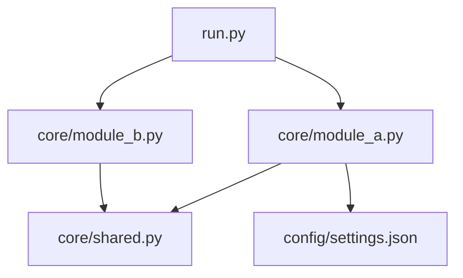

# ARCHITECTURE.md — Struktur & Modul-Graph

> **Zweck:** High-level Struktur, Komponenten-Beziehungen, Data-Flow.
> **Pflege:** Manuelle Abschnitte (Overview, Rationale) sind sofort nutzbar.
> Optional kann später ein projektspezifisches `_tools/arch-update` den
> AUTOGEN-Block pflegen.

---

## Overview (manuell)

[2-3 Absätze: Was ist das Projekt architektonisch? Welche Haupt-Komponenten
gibt es? Wie hängen sie zusammen? Was ist der Datenfluss?]

Beispiel:

> [Projektname] besteht aus drei Haupt-Komponenten:
> 1. **Pipeline** (`core/`) — modulare Verarbeitungs-Einheiten
> 2. **Config** (`config/`) — JSON-basierte Runtime-Konfiguration
> 3. **State** (`data/`) — persistente State-Dateien zwischen Runs
>
> Der Einstiegspunkt ist `run.py`, das basierend auf CLI-Flags einzelne
> `core/*.py`-Module orchestriert. Jedes Modul hat eigene State-Files und
> kann unabhängig laufen.

## Module-Graph (auto-generated)

<!-- @auto-generated:module-graph -->
<!-- last-updated: [YYYY-MM-DD] -->
<!-- tool: optional _tools/arch-update -->



<!-- @end:module-graph -->

## Modules (auto-generated)

<!-- @auto-generated:modules-table -->
<!-- last-updated: [YYYY-MM-DD] -->

| Module | LOC | Top Imports | Beschreibung |
|---|---|---|---|
| `core/module_a.py` | 245 | `requests`, `json` | [Erste Zeile Docstring] |
| `core/module_b.py` | 180 | `github`, `time` | [Erste Zeile Docstring] |
| `core/shared.py` | 95 | `pathlib`, `os` | [Erste Zeile Docstring] |

<!-- @end:modules-table -->

## Directory Tree (auto-generated)

<!-- @auto-generated:tree -->
<!-- last-updated: [YYYY-MM-DD] -->

```
[projekt]/
├── core/              # Haupt-Pipeline-Module
│   ├── module_a.py
│   ├── module_b.py
│   └── shared.py
├── config/            # Runtime-Config
│   └── settings.json
├── data/              # State-Files (gitignored)
│   └── state.json
├── tests/
├── workflows/
├── _tools/
└── .github/
```

<!-- @end:tree -->

## Data Flow (manuell)

[Beschreibung des Daten-Flusses: wo kommen Inputs rein, wie werden sie
verarbeitet, wo landen Outputs? Sequenz-Diagramm optional.]

```
[Input] → [Preprocessing] → [Core-Pipeline] → [Output]
             ↑                    ↓
        [Config]              [State-Persistence]
```

## External Dependencies

[Liste externe APIs, Services, Datenbanken, mit kurzer Beschreibung was
davon kritisch ist.]

| Dependency | Purpose | Criticality |
|---|---|---|
| [GitHub API] | [Repo-Management] | hoch |
| [Telegram Bot API] | [Benachrichtigungen] | mittel |

## Design Rationale (manuell)

[Warum diese Architektur und nicht eine andere? Verweise auf DECISIONS.md
für tiefere Entscheidungs-Hintergründe.]

Siehe auch [DECISIONS.md](./DECISIONS.md) für die ADRs (Architecture
Decision Records).

## Historie

- **[YYYY-MM-DD]** — Initiale Architektur dokumentiert
- **[YYYY-MM-DD]** — Modul X hinzugefügt
